# Tarea 01  

_Iván Eduardo Sedeño Jiménez_

## Teoría  

1. For each of parts (a) through (d), indicate whether we would generally expect the performance of a flexible statistical learning method to be better or worse than an inflexible method. Justify your answer.  
 - a) The sample size n is extremely large, and the number of predictors p is small.  
    >Utilizar un método flexible sería lo mejor, puesto que al tener un gran número de observaciones y pocos predictores se puede encontrar una mejor relación entre predictores y observaciones que si se usara una regresiñon lineal por ejemplo.

  - b) The number of predictors p is extremely large, and the number of observations n is small.  
      >Utilizar un método flexible tendría un peor desempeño ya que al usar tantos
      predictores para una muestra muy pequeña es probable que al final el modelo
      termine estando sobreajustado.  

  - c)	The relationship between the predictors and response is highly non-linear.  
      >Lo mejor sería usar un modelo flexible para que se ajuste a las distintas formas que pueden tener los datos, lo cual reduciría el residual de los datos con el modelo.

  - d)	The variance of the error terms, i.e. σ2 = Var(ε), is extremely high.  
      >Usar un modelo flexible sería peor que uno inflexible porque al utilizar un
      modelo flexible cuando la varianza es muy alta puede ocasionar que el modelo
      quede sobreajustado a los datos que se tienen.

2. Explain whether each scenario is a classification or regression problem, and indicate whether we are most interested in inference or prediction. Finally, provide n and p.  
  - a)	We collect a set of data on the top 500 firms in the US. For each firm we record profit, number of employees, industry and the CEO salary. We are interested in understanding which factors affect CEO salary.  
      >Regresión, nos interesa inferir a partir de los datos recolectados.  
      n = 500, p = 3 (record profit, number of employees & CEO salary).  

  - b)	We are considering launching a new product and wish to know whether it will be a success or a failure. We collect data on 20 similar products that were previously launched. For each product we have recorded whether it was a success or failure, price charged for the product, marketing budget, competition price, and ten other variables.  
      >Clasificación, nos interesa predecir si el producto será exitoso.  
      n = 20, p = 13 (price charged for the product, marketing budget, competition price & 10 other variables)  

  - c)	We are interested in predicting the % change in the US dollar in relation to the weekly changes in the world stock markets. Hence, we collect weekly data for all of 2012. For each week we record the % change in the dollar, the % change in the US market, the % change in the British market, and the % change in the German market.  
      >Inferencia, nos interesa predecir el cambio en el dolar con respecto al mercado accionario.  
      n = 52 (semanas que tiene un año), p = 3 (% change in the US market, the % change in the British market & the % change in the German market).  

3. We now revisit the bias-variance decomposition.  
  - a) Provide a sketch of typical (squared) bias, variance, training error, test error, and Bayes (or irreducible) error curves, on a single plot, as we go from less flexible statistical learning methods towards more flexible approaches. The x-axis should representthe amount of flexibility in the method, and the y-axis should represent the values for each curve. There should be five curves. Make sure to label each one.
     >```r
 	 >bias = function(x)350*exp(-0.65*x)  
  	>variance = function(x)x^3/3  
  	>train_error = function(x)450/(exp(0.7*x-1.5)+1)+15  
  	>test_error = function(x)variance(x)+bias(x)+bayes_error(x)+rnorm(1,mean=100,sd=20)  
  	>bayes_error = function(x)rnorm(1,mean=100,sd=11)+0*x  
  	>png("ch2_ex3.png")  
  	>curve(bias, xlim=c(0,10), ylim=c(0,600), xlab="flexibility", ylab="", col=1)  # bias
  	>curve(variance, add = TRUE, col=2)    # variance
  	>curve(train_error, add=TRUE, col=3)   # train error
  	>curve(bayes_error, add=TRUE, col=4)   # irreducible error
  	>curve(test_error, add = TRUE, col=5)  # test error
  	>legend(1,600,legend=c("bias","variance","train error","bayes error","test error"),col=1:5,lwd=1)  
  	>dev.off() ```  
  >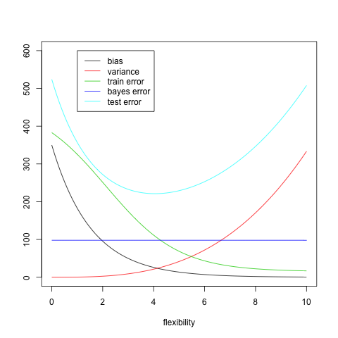

  * b) Explain why each of the five curves has the shape displayed in part (a).
  	> Bias: en __negro__, este reduce a medida que la flexibilidad aumenta, ya que no se asume la forma de los datos.  
  	>Variance: en __rojo__, este disminuye al aumentar la flexibilidad, ya que al volverse más flexible también se vuelve más sensible a los datos, por lo que cambiar el set de datos afectará mucho al modelo.  
  	>Train error: en __verde__, este disminuye al aumentar la flexibilidad ya que eventualmente quedará sobreajustado.  
  	>Bayes error: en __azul oscuro__ está el error irreducible, el cual es independiente del modelo.  
  	>Test error: en __azul claro__, este tiene forma de "U" ya que es la relación entre la varianza y el bias.  

4. You will now think of some real-life applications for statistical learning.
  * a) Describe three real-life applications in which classification might be useful. Describe the response, as well as the predictors. Is the goal of each application inference or prediction? Explain your answer.
  	> 1. La identificación de distintas lineas celulares cancerigenas, en los predictores se puede tener la expresión de distintos genes y la respuesta sería la Clasificación de las lineas celulares. La meta es inferir a artir de los genes que se expresan la lineal celular que es.
  	> 2. Identificaicón de plantas a partir de sus características, los predictores serían el tipo de hojas, fruto, tallo, etc. y la respuesta ser´ía el tipo de planta. La meta sería inferir que planta es a partir de sus características.
  	> 3. Determinar si un correo electrónico es spam o no, los predictores serían el dominio de la cuenta de correo, a cuantas personas se envió ese correo, el contenido del correo electrónico. La meta sería predecir si un correo es spam o no, y la respuesta sería mandarlo a la carpeta de spam.

  * b) Describe three real-life applications in which regression might be useful. Describe the response, as well as the predictors. Is the goal of each application inference or prediction? Explain your answer.  
  	> 1. Predecir la hora de llegada a un lugar, los predictores serían la distancia, la velocidad a la que se va a viajar, la velocidad del viento, temperatura, no. de paradas, hora de salida, la respuesta sería obtener la hora a la que se llega a un lugar, y la meta es predecirla.
  	> 2. Predecir la hora a la que va a ser la luna desde un lugar específico, los predictores serían la altitud, latidud, día, estación del año, la respuesta sería la hora a la que srñia visible la luna y la meta sería predecir lo que se quiere por respeusta.
  	> 3. Determinar que factores son los más importantes que determinan el precio de una casa, los predictores son el nuémero de escuelas cercanas, distancia al centro comercial más cercano, colonia, etc. La respuesta serían los coeficientes de los predictores y la meta es inferir cuales de los predictores son los más influyentes.

  * c) Describe three real-life applications in which cluster analysis might be useful.
  	> 1. Identificar personas con la misma ideología política.
  	> 2. Identificar personas más influyentes de un grupo social.
  	> 3. Agrupar zonas geográficas segun su aporte a la economñia de un país.

5. What are the advantages and disadvantages of a very flexible (versus a less flexible) approach for regression or classification? Under what circumstances might a more flexible approach be preferred to a less flexible approach? When might a less flexible approach be preferred?
  > Las ventajas de los modelos flexibles son que al no hacen tantas suposiciones de la forma de los datos y por lo tanto se ajustan mejor a datos con poca linealidad, desventajas son que hay un intercambio de flecibilidad e interpretabilidad, es más difñicil explicar una linea recta que un polinomio de grado 9, además que se puede caer en un sobreajuste.  
  > Es preferible utilziar un modelo flexible cuando los datos son poco lineales, en cambio es mejor utilizar un modelo inflexible cuando se está priorizando el aprender acerca del fenómeno que el ajustar una función a los datos, denuevo por la interpretabilidad.

6. Describe the differences between a parametric and a non-parametric statistical learning approach. What are the advantages of a parametric approach to regression or classification (as opposed to a nonparametric approach)? What are its disadvantages?
  > La ventaja de un modelo parametrico que al suponer una función para la forma de los datos, si se tiene información previa acerca del fenómeno, esta se puede incorporar al mmodelo. Una desventaja sería que puede que la suposición hecha acerca de la forma de los datos no sea correcta y al expandir el dataset se encuentra que el dataset usado en un principio no era representativo de la forma de los datos.
  > La ventaja de un modelo no parametrico es que al no asumir ninguna forma para los datos, se puede ajustar un modelo sin importar como sean los datos, la desventaja es que si el dataset no es representativo de la forma de los datos entonces entonces el modelo obtenido va a ser incorrecto.

7. The table below provides a training data set containing six observations, three predictors, and one qualitative response variable.  
Obs.|X1|X2|X3|Y  
--|---|---|---|---  
1 | 0 | 3 | 0 |RED  
2 | 2 | 0 | 0 |RED  
3 | 0 | 1 | 3 |RED  
4 | 0 | 1 | 2 |GREEN  
5 | -1| 0 | 1 |GREEN  
6 | 1 | 1 | 1 |RED  

  Suppose we wish to use this data set to make a prediction for Y when X1 = X2 = X3 = 0 using K-nearest neighbors.
  * a) Compute the Euclidean distance between each observation and thetestpoint,X1 =X2 =X3 =0.
  	>```r
  	>#Observations
  	>o1 = c(0,3,0)
  	>o2 = c(2,0,0)
  	>o3 = c(0,1,3)
  	>o4 = c(0,1,2)
  	>o5 = c(-1,0,1)
  	>o6 = c(1,1,1)
  	>#Origin
  	>orig = c(0,0,0)
  	>#All observations together
  	>obs = matrix(c(o1,o2,o3,o4,o5,o6),ncol=3,byrow = T)
  	>#Computing distances
  	>dist = function(x){sqrt(sum((x-orig)^2))}
  	>by(obs,1:nrow(obs),dist,simplify = FALSE)```
  d1 = 3  
  d2 = 2  
  d3 = 3.162278  
  d4 = 2.236068  
  d5 = 1.414214  
  d6 = 1.732051

  * b) What is our prediction with K = 1? Why?
  	> El vecino más cercano es la observación no. 5 con una distancia de 1.414214, por lo que se puede predecir que será verde.

  * c) What is our prediction with K = 3? Why?
  	> Los tres vecinos más cercanos son las observaciones 5, 6 y 2, en ese orden, la observación 5 es verde mientras que las otras dos son rojas, por lo tanto, es razonable suponer que será roja.

  * d) If the Bayes decision boundary in this problem is highly non- linear, then would we expect the best value for K to be large or small? Why?
  	> Si es altamente no lineal es mejor una k pequeño, puesto que si comenzamos a usar una k cada vez más grande la frontera se vuelve poco flexible.

## Práctica
8. This exercise relates to the College data set, which can be found in the file College.csv. It contains a number of variables for 777 different universities and colleges in the US. The variables are
• Private : Public/private indicator  
• Apps : Number of applications received  
• Accept : Number of applicants accepted  
• Enroll : Number of new students enrolled  
• Top10perc : New students from top 10 % of high school class  
• Top25perc : New students from top 25 % of high school class  
• F.Undergrad : Number of full-time undergraduates  
• P.Undergrad : Number of part-time undergraduates  
• Outstate : Out-of-state tuition  
• Room.Board : Room and board costs  
• Books : Estimated book costs  
• Personal : Estimated personal spending  
• PhD : Percent of faculty with Ph.D.’s  
• Terminal : Percent of faculty with terminal degree  
• S.F.Ratio : Student/faculty ratio  
• perc.alumni : Percent of alumni who donate  
• Expend : Instructional expenditure per student  
• Grad.Rate : Graduation rate  
Before reading the data into R, it can be viewed in Excel or a text editor.
  * a) Use the read.csv() function to read the data into R. Call the loaded data college. Make sure that you have the directory set to the correct location for the data.  
  >```r
  getwd()
  setwd("./ISLR-master/")
  college = read.csv("College.csv")```

  * b) Look at the data using the fix() function. You should notice that the first column is just the name of each university. We don’t really want R to treat this as data. However, it may be handy to have these names for later. Try the following commands:
  ```r
  rownames(college)=college[,1]  
  fix(college)```  

  You should see that there is now a row.names column with the name of each university recorded. This means that R has given each row a name corresponding to the appropriate university. R will not try to perform calculations on the row names. However, we still need to eliminate the first column in the data where the names are stored. Try
  ```r
  college=college[,-1]  
  fix(college)```  
  Now you should see that the first data column is ``Private``. Note that another column labeled ``row.names`` now appears before the ``Private`` column. However, this is not a data column but rather the name that ``R`` is giving to each row.  
  * c)
      1. Use the ``summary()`` function to produce a numerical summary of the variables in the data set.  
      > ```r
      summary(college)```
      >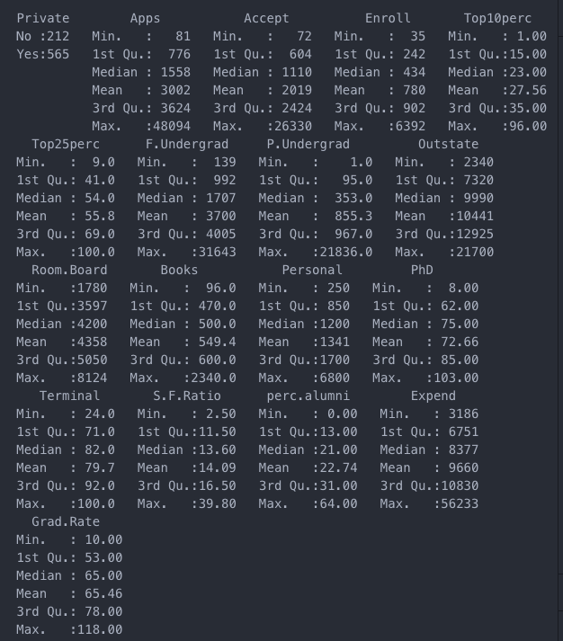

      2. Use the ``pairs()`` function to produce a scatterplot matrix of the first ten columns or variables of the data. Recall that you can reference the first ten columns of a matrix A using ``A[,1:10]``.
      > ```r
      png("ch02_ex08_c_2.png")
      pairs(college[,1:10])
      dev.off()```
      >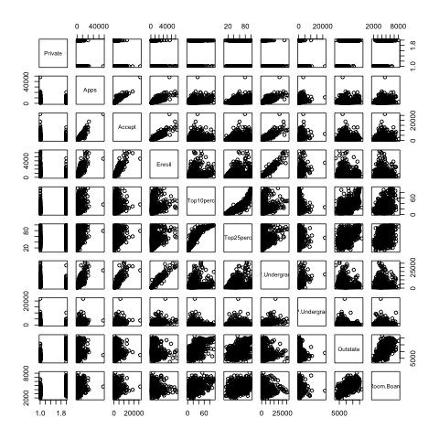

      3. Use the ``plot()`` function to produce side-by-side boxplots of ``Outstate`` versus ``Private``.
      >```r
      ```
      >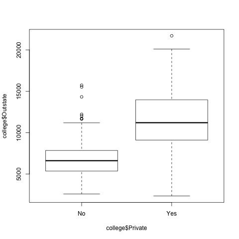
      4. Create a new qualitative variable, called ``Elite``, by binning the ``Top10perc`` variable. We are going to divide universities into two groups based on whether or not the proportion of students coming from the top 10% of their high school classes exceeds 50 %.
      ```r
      Elite=rep("No",nrow(college))  
      Elite[college$Top10perc >50]="Yes"  
      Elite=as.factor(Elite)  
      college=data.frame(college ,Elite)
      ```
      Use the ```summary()``` function to see how many elite universities there are. Now use the ```plot()``` function to produce side-by-side boxplots of ```Outstate``` versus ```Elite```.  
      >```r
      >###Después de hacer lo indicado por el libro:
      summary(college)
      png("ch02_ex08_c_4.png")
      plot(college$Outstate~college$Elite)
      dev.off()
      ```
      >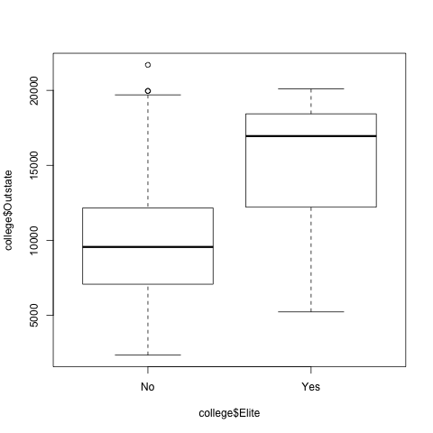

      5. Use the ``hist()`` function to produce some histograms with differing numbers of bins for a few of the quantitative variables. You may find the command ``par(mfrow=c(2,2))`` useful: it will divide the print window into four regions so that four plots can be made simultaneously. Modifying the arguments to this function will divide the screen in other ways.
      > ```r
      png("ch02_ex08_c_5.png")
      par(mfrow=c(2,2))
      hist(College$Apps, breaks=30, main="Apps")
      hist(College$Enroll, breaks=25, main="Enroll")
      hist(College$Expend, breaks=20, main="Expend")
      hist(College$Outstate, breaks=15, main="Outstate")
      dev.off()
      ```
      >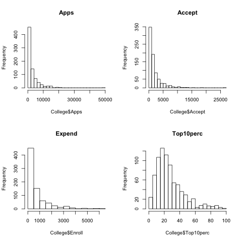
      6. Continue exploring the data, and provide a brief summary of what you discover.
      > ```r
      summary(college)
      plot(college)
      plot(college[,-c(1:2,8:12,15:19)])
      png("ch02_ex08_c_6.png")
      par(mfrow=c(2,2))
      plot(college$PhD,college$Terminal)
      plot(college$Enroll,college$F.Undergrad)
      plot(college$Accept,college$Enroll)
      plot(college$Top10perc,college$Top25perc)
      dev.off()
      ```
      >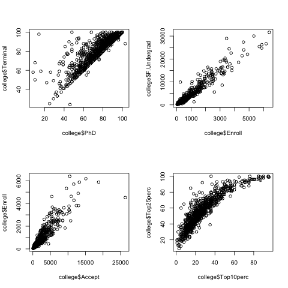
      >Como era de esperarse hay una relación lineal entre número de profesores con doctorado y porcentaje de profesores con grado terminal, aunque hay algunos puntos que se salen de la diagonal de manera muy marcada.  
      >También, hay una relación lineal entre el número de estudiantes nuevos y el número de estudiantes de tiempo completo, las universidades que más aceptan también tienen más estudiante.  
      >El número de estudiantes aceptados al año y estudiantes nuevos al año también es lineal aunque no en la misma escala, se puede ver que en "x" llega hasta 25000 mientras que en "y" llega a 6000, además parece haber un dato que se sale de la tendencia lineal.  
      >De manera obvia tambiñen hay una relación entre el número de estudiantes nuevos que estaban en el top 10% de su clase de preparatoria y los que estaban en el top 25%, aunque no es lineal, más bien cuadratica.
9. This exercise involves the Auto data set studied in the lab. Make sure that the missing values have been removed from the data.
  > ```r
  library(ISLR)
  data(Auto)
  >###We make sure there are no na`s
  Auto = na.omit(Auto)
  ```

  * a) Which of the predictors are quantitative, and which are qualitative?  
  > ```r
  summary(Auto)
  str(Auto)
  ```
  Cuantitativos:  
	mpg, cylinders, displacement, horsepower, weight, acceleration & year  
Cualitativos:  
	origin & name  

  * b) What is the range of each quantitative predictor? You can answer this using the range() function.  
  > ```r
  lapply(Auto[,1:7],range)
  ```
  mpg: 9-46.6  
  cylinders: 3-8  
  displacement: 68-455  
  horsepower: 46-230  
  weight: 1613-5140  
  acceleration: 8-24.8  
  year: 70-82  

  * c) What is the mean and standard deviation of each quantitative predictor?
  >```r
  lapply(Auto[,1:7],mean)
  lapply(Auto[,1:7],sd)
  ```
  Predictor|Media|Desv.est  
  >---------|-----|--------  
  mpg|23.4459183673469|7.8050074865718  
  cylinders|5.4719387755102|1.70578324745278  
  displacement|194.411989795918|104.644003908905  
  horsepower|104.469387755102|38.4911599328285  
  weight|2977.58418367347|849.402560042949  
  acceleration|15.5413265306122|2.75886411918808  
  year|75.9795918367347|3.68373654357783  

  * d) Now remove the 10th through 85th observations. What is the range, mean, and standard deviation of each predictor in the subset of the data that remains?
  > ```r
  apply(Auto[-(10:85),1:7],range)
  lapply(Auto[-(10:85),1:7],mean)
  lapply(Auto[-(10:85),1:7],sd)
  ```
  Predictor|Range|Media|Desv.est  
  >---------|----|-----|--------  
  mpg|11-46.6|24.4044303797468|7.86728282443069
  cylinders|3-8|5.37341772151899|1.65417865185607
  displacement|68-455|187.240506329114|99.6783672303628
  horsepower|46-230|100.721518987342|35.7088532738003
  weight|1649-4997|2935.97151898734|811.30020815829
  acceleration|18.5-24.8|15.7268987341772|2.69372071752036
  year|70-82|77.1455696202532|3.10621690872137

  * e) Using the full data set, investigate the predictors graphically, using scatterplots or other tools of your choice. Create some plots highlighting the relationships among the predictors. Comment on your findings.
  > ```r
  png("ch02_ex09_e.png")
  pairs(Auto[,1:7])
  dev.off()```
  >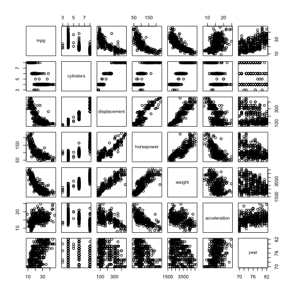  
  > __mpg__ tiene una relación negative con displacement, horsepower y weight.  
  __cylinders__ tiene una relación positive con displacement.  
  __displacement__ tiene una clara relación positiva con horsepower y weight, y una relación negativa no tan clara con acceleration.  
  __Horse power__ tiene una relación positiva y negativa con weight y acceleration respectivamente.  

  * f) Suppose that we wish to predict gas mileage (mpg) on the basis of the other variables. Do your plots suggest that any of the other variables might be useful in predicting mpg? Justify your answer.
  > Sí, mpg tiene una clara relación negativa con displacement, horsepower y weight. Aunque de forma menos clara, también se puede ver que se influenciada positivamente por acceleration y año. Finalmente también se puede ver aunque de forma no tan clara que en general entre menos cilindros mayor mpg.
10. This exercise involves the Boston housing data set.  
  * a) To begin, load in the Boston data set. The Boston data set is part of the MASS library in R.
  ```r
  ibrary(MASS)```
  Now the data set is contained in the object ``Boston``.
  ```r
  Boston```
  Read about the data set:
  ```r
  Boston```
  How many rows are in this data set? How many columns? What do the rows and columns represent?
  >Tiene 506 filas y 14 columnas. Las filas representan las observaciones y las columnas las variables.

  * b) Make some pairwise scatterplots of the predictors (columns) in this data set. Describe your findings.
  >```r
  png("ch02_ex10_b.png")
  pairs(Boston)
  dev.off()```
  >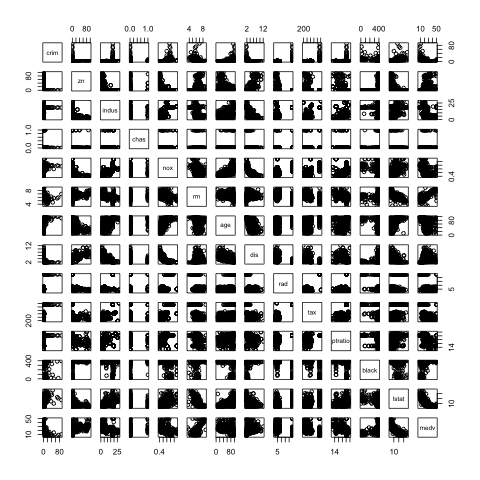  
  >Parece haber una relación no lineal entre nox y dis. También parece ser que rm y medv tienen una relación lineal. Además parece ser que lstat y medv están relacionadas.

  * c) Are any of the predictors associated with per capita crime rate? If so, explain the relationship.
  >```r
  library(ggplot2)
  library(reshape2)
  scatter_crim =ggplot(melt(Boston,id="crim"),aes(x=value,y=crim)) +
  geom_point() +
  facet_wrap(~variable, scales = 'free_x')
  >png("ch02_ex10_c.png")
  scatter_crim
  dev.off()```
  >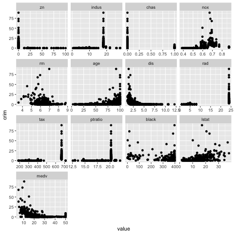  
  >No parece haber ninguna relación clara entre la variable crim y el resto de las variables aunque vale la pena destacar que para valores de z grandes crim es pequeño (casi 0) y para la variable rad ocurre lo tax ocurre lo opuesto.

  * d) Do any of the suburbs of Boston appear to have particularly high crime rates? Tax rates? Pupil-teacher ratios? Comment on the range of each predictor.
  > ```r
  png("ch02_ex10_d.png")
  ggplot(melt(t(Boston)),aes(x=Var2,y=value)) +
  geom_point() +
  facet_wrap(~Var1, scales = 'free')
  dev.off()```
  >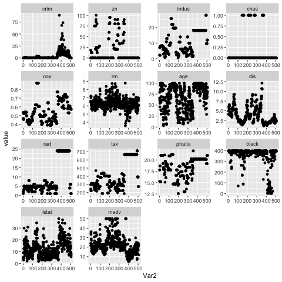
  >Hay mayores tasas de crimen e impuestos en los suburbios >300, el ptratio es menor en los suburbios entre 200 y 350 pero no es significativo.

  * e) How many of the suburbs in this data set bound the Charles river?
  >```r
  >table(Boston$chas)```
  > 35 suburbios.

  * f) What is the median pupil-teacher ratio among the towns in this data set?
  >```r
  median(Boston$ptratio)```
  > 19.05

  * g) Which suburb of Boston has lowest median value of owner- occupied homes? What are the values of the other predictors for that suburb, and how do those values compare to the overall ranges for those predictors? Comment on your findings.  
  > Suburbios con menor valor medio:  
  >|	| crim | zn      | indus | chas | nox | rm    | age   | dis | rad    | tax | ptratio | black | lstat  | medv
  |------|---------|-------|------|-----|-------|-------|-----|--------|-----|---------|-------|--------|-------|---|
  | 399  | 38.3518 | 0     | 18.1 | 0   | 0.693 | 5.453 | 100 | 1.4896 | 24  | 666     | 20.2  | 396.90 | 30.59 | 5 |
  | 406  | 67.9208 | 0     | 18.1 | 0   | 0.693 | 5.683 | 100 | 1.4254 | 24  | 666     | 20.2  | 384.97 | 22.98 | 5 |
  >
  > Comparación con sus rangos:
  > |	| crim      | zn    | indus | chas | nox   | rm     | age     | dis       | rad | tax | ptratio | black    | lstat  | medv   |
|-------|-----------|-------|-------|------|-------|--------|---------|-----------|-----|-----|---------|----------|--------|--------|
| 0%    | 0.006320  | 0.0   | 0.46  | 0    | 0.385 | 3.5610 | 2.900   | 1.129600  | 1   | 187 | 12.60   | 0.3200   | 1.730  | 5.000  |
| 25%   | 0.082045  | 0.0   | 5.19  | 0    | 0.449 | 5.8855 | 45.025  | 2.100175  | 4   | 279 | 17.40   | 375.3775 | 6.950  | 17.025 |
| 50%   | 0.256510  | 0.0   | 9.69  | 0    | 0.538 | 6.2085 | 77.500  | 3.207450  | 5   | 330 | 19.05   | 391.4400 | 11.360 | 21.200 |
| 75%   | 3.677083  | 12.5  | 18.10 | 0    | 0.624 | 6.6235 | 94.075  | 5.188425  | 24  | 666 | 20.20   | 396.2250 | 16.955 | 25.000 |
| 100%  | 88.976200 | 100.0 | 27.74 | 1    | 0.871 | 8.7800 | 100.000 | 12.126500 | 24  | 711 | 22.00   | 396.9000 | 37.970 | 50.000 |

  * h) In this data set, how many of the suburbs average more than seven rooms per dwelling? More than eight rooms per dwelling? Comment on the suburbs that average more than eight rooms per dwelling.
  >```r
  nrow(Boston[Boston$rm > 7,])
  nrow(Boston[Boston$rm > 8,])
  rbind(sapply(Boston[Boston$rm > 8,], mean), sapply(Boston, mean))```
  |  | crim       | zn        | indus     | chas      | nox       | rm       | age       | dis       | rad       | tax      | ptratio  | black    | lstat  | medv   |
  |------|------------|-----------|-----------|-----------|-----------|----------|-----------|-----------|-----------|----------|----------|----------|--------|--------|
  |  | 0.7187954  | 13.61538  | 7.078462  | 0.1538462 | 0.5392385 | 8.348538 | 71.53846  | 3.430192  | 7.461538  | 325.0769 | 16.36154 | 385.2108 | 4.310  | 44.200 |
  | 0%   | 0.0063200  | 0.00000   | 0.460000  | 0.0000000 | 0.3850000 | 3.561000 | 2.90000   | 1.129600  | 1.000000  | 187.0000 | 12.60000 | 0.3200   | 1.730  | 5.000  |
  | 25%  | 0.0820450  | 0.00000   | 5.190000  | 0.0000000 | 0.4490000 | 5.885500 | 45.02500  | 2.100175  | 4.000000  | 279.0000 | 17.40000 | 375.3775 | 6.950  | 17.025 |
  | 50%  | 0.2565100  | 0.00000   | 9.690000  | 0.0000000 | 0.5380000 | 6.208500 | 77.50000  | 3.207450  | 5.000000  | 330.0000 | 19.05000 | 391.4400 | 11.360 | 21.200 |
  | 75%  | 3.6770825  | 12.50000  | 18.100000 | 0.0000000 | 0.6240000 | 6.623500 | 94.07500  | 5.188425  | 24.000000 | 666.0000 | 20.20000 | 396.2250 | 16.955 | 25.000 |
  | 100% | 88.9762000 | 100.00000 | 27.740000 | 1.0000000 | 0.8710000 | 8.780000 | 100.00000 | 12.126500 | 24.000000 | 711.0000 | 22.00000 | 396.9000 | 37.970 | 50.000 |
  >
  > Están en el tercer cuartil de tasa de criminalidad, zn, nox, dis y rad.  
  > Están por debajo de la mediana en indus, edad, impuestos, black y lstat.
