# Tarea 02

_Iván Eduardo Sedeño Jiménez_

## Teoría  

1. Describe the null hypotheses to which the p-values given in Table 3.4 correspond. Explain what conclusions you can draw based on these p-values. Your explanation should be phrased in terms of sales, TV, radio, and newspaper, rather than in terms of the coefficients of the linear model.
    >  
    >Parece ser que contrario a radio y TV, newspaper no tiene una relación con la variable sales.  

2. Carefully explain the differences between the KNN classifier and KNN regression methods.
    > En regresión KNN se predice una variable a partir de las más cercanas, en clasificación KNN se asigna a un grupo una observación a partir de las observaciones más cercanas espacialmente.  

3. Suppose we have a data set with five predictors, X1 = GPA, X2 = IQ, X3 = Gender (1 for Female and 0 for Male), X4 = Interaction between GPA and IQ, and X5 = Interaction between GPA and Gender. The response is starting salary after graduation (in thousands of dollars). Suppose we use least squares to fit the model, and get βˆ0 = 50, βˆ1 = 2 0 , βˆ 2 = 0 . 0 7 , βˆ 3 = 3 5 , βˆ 4 = 0 . 0 1 , βˆ 5 = − 1 0 .
 - a) Which answer is correct, and why?  
    1. ForafixedvalueofIQandGPA,malesearnmoreonaverage than females.
    2. For a fixed value of IQ and GPA, females earn more on average than males.
    3. For a fixedvalueofIQandGPA,malesearnmoreonaverage than females provided that the GPA is high enough.
    4. For a fixed value of IQ and GPA, females earn more on average than males provided that the GPA is high enough.
    > La tercera es verdadera, las demás no se cumplen para ciertos valores de IQ y/o GPA.  

 - b) Predict the salary of a female with IQ of 110 and a GPA of 4.0.
    > Salary = 50 + 20x4.0 + 0.07x110 + 35x1 + 0.01x4.0x110 - 10x4.0x1
    > Salary = 137.1 (Que por escala se multiplica por mil dólares).  

 - c) True or false: Since the coefficient for the GPA/IQ interaction term is very small, there is very little evidence of an interaction effect. Justify your answer.
    > Falso, aunque el coeficiente es pequeño, los valores de IQ son bastante más grandes comparados con los del resto de los predictores, por lo que al final es necesario tomarlo en cuenta.

4. I collect a set of data (n = 100 observations) containing a single predictor and a quantitative response. I then fit a linear regression model to the data, as well as a separate cubic regression, i.e. Y = β0 +β1X +β2X2 +β3X3 +ε.
 - a) Suppose that the true relationship between X and Y is linear, i.e. Y = β0 + β1X + ε. Consider the training residual sum of squares (RSS) for the linear regression, and also the training RSS for the cubic regression. Would we expect one to be lower than the other, would we expect them to be the same, or is there not enough information to tell? Justify your answer.
    > El RSS disminuira para el modelo cúbico, probablemente haya overfitting.  

 - b) Answer (a) using test rather than training RSS.  
    > El RSS disminuira para el modelo lineal, el cúbico probablemente tenga overfitting y aumente su RSS.
 - c) Suppose that the true relationship between X and Y is not linear, but we don’t know how far it is from linear. Consider the training RSS for the linear regression, and also the training RSS for the cubic regression. Would we expect one to be lower than the other, would we expect them to be the same, or is there not enough information to tell? Justify your answer.  
    > El modelo RSS tendrá un menor RSS al ser no lienal.
 - d) Answer (c) using test rather than training RSS.  
    > No hay suficiente información.
5. Consider the fitted values that result from performing linear regres- sion without an intercept. In this setting, the ith fitted value takes the form  

    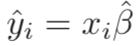  

    where  

    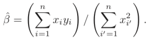  (3.38)

    Show that we can write

    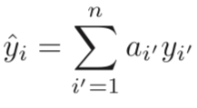

    What is ai′ ?  
    Note: We interpret this result by saying that the fitted values from linear regression are linear combinations of the response values.
    >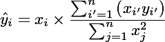  
    >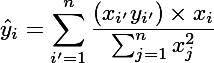  
    >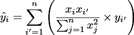  
    >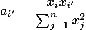  

6. Using (3.4), argue that in the case of simple linear regression, the least squares line always passes through the point (x ̄, y ̄).
    > Siguiendo la ecuación 3.4:
    > 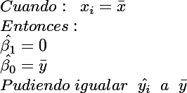

7. It is claimed in the text that in the case of simple linear regression of Y onto X, the R^2 statistic (3.17) is equal to the square of the correlation between X and Y (3.18). Prove that this is the case. For simplicity, you may assume that x ̄ = y ̄ = 0.  
    > 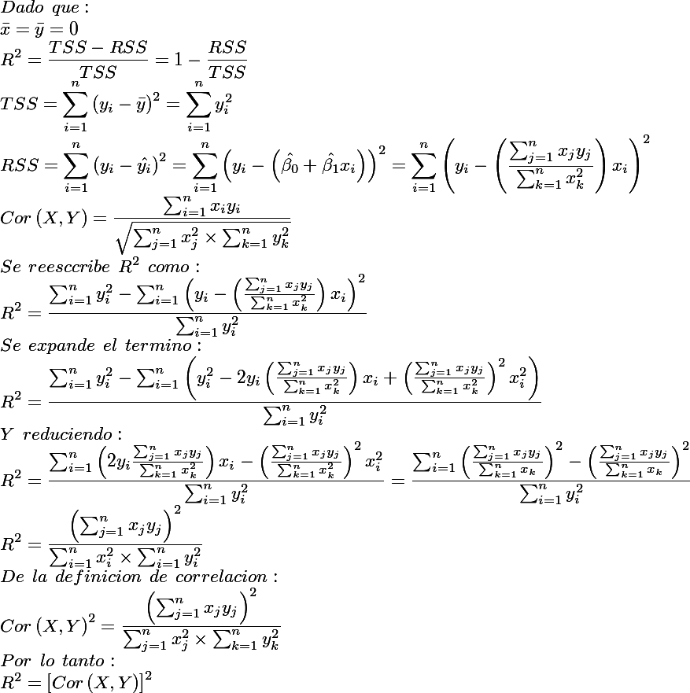
## Practica  
8. This question involves the use of simple linear regression on the Auto data set.
 - a) Use the lm() function to perform a simple linear regression with mpg as the response and horsepower as the predictor. Use the summary() function to print the results. Comment on the output. For example:  
    1. Is there a relationship between the predictor and the re- sponse?
    2. How strong is the relationship between the predictor and the response?
    3. Is the relationship between the predictor and the response positive or negative?
    4. What is the predicted mpg associated with a horsepower of 98? What are the associated 95 % confidence and prediction intervals?
 - b) Plot the response and the predictor. Use the abline() function to display the least squares regression line.
 - c) Use the plot() function to produce diagnostic plots of the least squares regression fit. Comment on any problems you see with the fit.
9. This question involves the use of multiple linear regression on the Auto data set.
 - a) Produce a scatterplot matrix which includes all of the variables in the data set.
 - b) Compute the matrix of correlations between the variables using the function cor(). You will need to exclude the name variable, which is qualitative.
 - c) Use the lm() function to perform a multiple linear regression with mpg as the response and all other variables except name as the predictors. Use the summary() function to print the results.  
 Comment on the output. For instance:  
    1. Is there a relationship between the predictors and the re- sponse?
    2. Which predictors appear to have a statistically significant relationship to the response?
    3. What does the coefficient for the year variable suggest?
 - d) Use the plot() function to produce diagnostic plots of the linear regression fit. Comment on any problems you see with the fit. Do the residual plots suggest any unusually large outliers? Does the leverage plot identify any observations with unusually high leverage?
 - e) Use the * and : symbols to fit linear regression models with interaction effects. Do any interactions appear to be statistically significant?
 - f) Try a few different transformations of the variables, such as log(X), √X, X2. Comment on your findings.
10. This question should be answered using the Carseats data set.
 - a) Fit a multiple regression model to predict Sales using Price,
Urban, and US.
 - b) Provide an interpretation of each coefficient in the model. Be
careful—some of the variables in the model are qualitative!
 - c) Write out the model in equation form, being careful to handle the qualitative variables properly.
 - d) For which of the predictors can you reject the null hypothesis H0 :βj =0?
 - e) Use the * and : symbols to fit linear regression models with interaction effects. Do any interactions appear to be statistically significant?
 - f) How well do the models in (a) and (e) fit the data?
 - g) Using the model from (e), obtain 95% confidence intervals for the coefficient(s).
 - h) Is there evidence of outliers or high leverage observations in the model from (e)?  
11. In this problem we will investigate the t-statistic for the null hypoth- esis H0 : β = 0 in simple linear regression without an intercept. To begin, we generate a predictor x and a response y as follows.  
    ```r
    > set . seed (1)
    > x=rnorm(100)
    > y=2*x+rnorm(100)
    ```
  - a) Perform a simple linear regression of y onto x, without an in- tercept. Report the coefficient estimate βˆ, the standard error of this coefficient estimate, and the t-statistic and p-value associ- ated with the null hypothesis H0 : β = 0. Comment on these results. (You can perform regression without an intercept using the command lm(y∼x+0).)
  - b) Now perform a simple linear regression of x onto y without an intercept, and report the coefficient estimate, its standard error, and the corresponding t-statistic and p-values associated with the null hypothesis H0 : β = 0. Comment on these results.
  - c)  What is the relationship between the results obtained in (a) and (b)?
  - d) For the regression of Y onto X without an intercept, the t- statistic for H0 : β = 0 takes the form βˆ/SE(βˆ), where βˆ is given by (3.38), and where  

    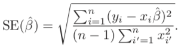  

    (These formulas are slightly different from those given in Sec- tions 3.1.1 and 3.1.2, since here we are performing regression without an intercept.) Show algebraically, and confirm numeri- cally in R, that the t-statistic can be written as  

    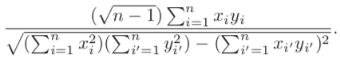

 - e) Using the results from (d), argue that the t-statistic for the re- gression of y onto x is the same as the t-statistic for the regression of x onto y.
 - f) In R, show that when regression is performed with an intercept, the t-statistic for H0 : β1 = 0 is the same for the regression of y onto x as it is for the regression of x onto y.
12. This problem involves simple linear regression without an intercept.
 - a) Recall that the coefficient estimate βˆ for the linear regression of Y onto X without an intercept is given by (3.38). Under what circumstance is the coefficient estimate for the regression of X onto Y the same as the coefficient estimate for the regression of Y onto X?
 - b) Generate an example in R with n = 100 observations in which the coefficient estimate for the regression of X onto Y is different from the coefficient estimate for the regression of Y onto X.
 - c) Generate an example in R with n = 100 observations in which the coefficient estimate for the regression of X onto Y is the same as the coefficient estimate for the regression of Y onto X.
13. In this exercise you will create some simulated data and will fit simple linear regression models to it. Make sure to use set.seed(1) prior to starting part (a) to ensure consistent results.
 - a) Using the rnorm() function, create a vector, x, containing 100 observations drawn from a N(0,1) distribution. This represents a feature, X.
 - b)Using the rnorm() function, create a vector, eps, containing 100 observations drawn from a N(0,0.25) distribution i.e. a normal distribution with mean zero and variance 0.25.
 - c) Using x and eps, generate a vector y according to the model

     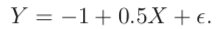 (3.39)

     What is the length of the vector y? What are the values of β0 and β1 in this linear model?
 - d) Create a scatterplot displaying the relationship between x and y. Comment on what you observe.
 - e) Fit a least squares linear model to predict y using x. Comment on the model obtained. How do βˆ0 and βˆ1 compare to β0 and β1?
 - f) Display the least squares line on the scatterplot obtained in (d). Draw the population regression line on the plot, in a different color. Use the legend() command to create an appropriate leg- end.
 - g) Now fit a polynomial regression model that predicts y using x and x2. Is there evidence that the quadratic term improves the model fit? Explain your answer.
 - h) Repeat (a)–(f) after modifying the data generation process in such a way that there is less noise in the data. The model (3.39) should remain the same. You can do this by decreasing the vari- ance of the normal distribution used to generate the error term ε in (b). Describe your results.
 - i) Repeat (a)–(f) after modifying the data generation process in such a way that there is more noise in the data. The model (3.39) should remain the same. You can do this by increasing the variance of the normal distribution used to generate the error term ε in (b). Describe your results.
 - j) What are the confidence intervals for β0 and β1 based on the original data set, the noisier data set, and the less noisy data set? Comment on your results.
14. This problem focuses on the collinearity problem.
 - a) Perform the following commands in R:
    ```r
    > set.seed(1)
    > x1=runif(100)
    > x2=0.5*x1+rnorm(100)/10
    > y=2+2*x1+0.3*x2+rnorm(100)
    ```
 The last line corresponds to creating a linear model in which y is a function of x1 and x2. Write out the form of the linear model. What are the regression coefficients?
 - b) What is the correlation between x1 and x2? Create a scatterplot displaying the relationship between the variables.
 - c) Using this data, fit a least squares regression to predict y using x1 and x2. Describe the results obtained. What are βˆ0, βˆ1, and βˆ2? How do these relate to the true β0, β1, and β2? Can you reject the null hypothesis H0 : β1 = 0? How about the null hypothesis H0 : β2 = 0?
 - d) Now fit a least squares regression to predict y using only x1. Comment on your results. Can you reject the null hypothesis H0 :β1 =0?
 - e) Now fit a least squares regression to predict y using only x2. Comment on your results. Can you reject the null hypothesis H0 :β1 =0?
 - f) Do the results obtained in (c)–(e) contradict each other? Explain your answer.
 - g) Now suppose we obtain one additional observation, which was unfortunately mismeasured.
    ```r
    > x1=c(x1, 0.1)
    > x2=c(x2, 0.8)
    > y=c(y,6)
    ```
 Re-fit the linear models from (c) to (e) using this new data. What effect does this new observation have on the each of the models? In each model, is this observation an outlier? A high-leverage point? Both? Explain your answers.
15. This problem involves the Boston data set, which we saw in the lab for this chapter. We will now try to predict per capita crime rate using the other variables in this data set. In other words, per capita crime rate is the response, and the other variables are the predictors.
 - a) For each predictor, fit a simple linear regression model to predict the response. Describe your results. In which of the models is there a statistically significant association between the predictor and the response? Create some plots to back up your assertions.
 - b) Fit a multiple regression model to predict the response using all of the predictors. Describe your results. For which predictors can we reject the null hypothesis H0 : βj = 0?
 - c) How do your results from (a) compare to your results from (b)? Create a plot displaying the univariate regression coefficients from (a) on the x-axis, and the multiple regression coefficients from (b) on the y-axis. That is, each predictor is displayed as a single point in the plot. Its coefficient in a simple linear regres- sion model is shown on the x-axis, and its coefficient estimate in the multiple linear regression model is shown on the y-axis.
 - d) Is there evidence of non-linear association between any of the predictors and the response? To answer this question, for each predictor X, fit a model of the form

     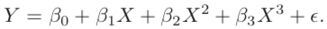
