# Tarea 02

_Iván Eduardo Sedeño Jiménez_

## Teoría  

1. Describe the null hypotheses to which the p-values given in Table 3.4 correspond. Explain what conclusions you can draw based on these p-values. Your explanation should be phrased in terms of sales, TV, radio, and newspaper, rather than in terms of the coefficients of the linear model.
    >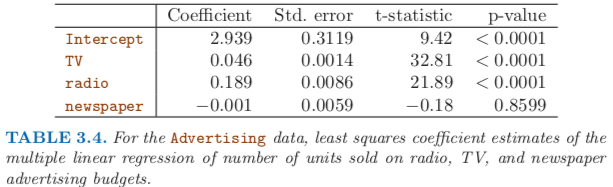  
    >Parece ser que contrario a radio y TV, newspaper no tiene una relación con la variable sales.  

2. Carefully explain the differences between the KNN classifier and KNN regression methods.
    > En regresión KNN se predice una variable a partir de las más cercanas, en clasificación KNN se asigna a un grupo una observación a partir de las observaciones más cercanas espacialmente.  

3. Suppose we have a data set with five predictors, X1 = GPA, X2 = IQ, X3 = Gender (1 for Female and 0 for Male), X4 = Interaction between GPA and IQ, and X5 = Interaction between GPA and Gender. The response is starting salary after graduation (in thousands of dollars). Suppose we use least squares to fit the model, and get βˆ0 = 50, βˆ1 = 2 0 , βˆ 2 = 0 . 0 7 , βˆ 3 = 3 5 , βˆ 4 = 0 . 0 1 , βˆ 5 = − 1 0 .
 - a) Which answer is correct, and why?  
    1. ForafixedvalueofIQandGPA,malesearnmoreonaverage than females.
    2. For a fixed value of IQ and GPA, females earn more on average than males.
    3. For a fixedvalueofIQandGPA,malesearnmoreonaverage than females provided that the GPA is high enough.
    4. For a fixed value of IQ and GPA, females earn more on average than males provided that the GPA is high enough.
    > La tercera es verdadera, las demás no se cumplen para ciertos valores de IQ y/o GPA.  

 - b) Predict the salary of a female with IQ of 110 and a GPA of 4.0.
    > Salary = 50 + 20x4.0 + 0.07x110 + 35x1 + 0.01x4.0x110 - 10x4.0x1
    > Salary = 137.1 (Que por escala se multiplica por mil dólares).  

 - c) True or false: Since the coefficient for the GPA/IQ interaction term is very small, there is very little evidence of an interaction effect. Justify your answer.
    > Falso, aunque el coeficiente es pequeño, los valores de IQ son bastante más grandes comparados con los del resto de los predictores, por lo que al final es necesario tomarlo en cuenta.

4. I collect a set of data (n = 100 observations) containing a single predictor and a quantitative response. I then fit a linear regression model to the data, as well as a separate cubic regression, i.e. Y = β0 +β1X +β2X2 +β3X3 +ε.
 - a) Suppose that the true relationship between X and Y is linear, i.e. Y = β0 + β1X + ε. Consider the training residual sum of squares (RSS) for the linear regression, and also the training RSS for the cubic regression. Would we expect one to be lower than the other, would we expect them to be the same, or is there not enough information to tell? Justify your answer.
    > El RSS disminuira para el modelo cúbico, probablemente haya overfitting.  

 - b) Answer (a) using test rather than training RSS.  
    > El RSS disminuira para el modelo lineal, el cúbico probablemente tenga overfitting y aumente su RSS.
 - c) Suppose that the true relationship between X and Y is not linear, but we don’t know how far it is from linear. Consider the training RSS for the linear regression, and also the training RSS for the cubic regression. Would we expect one to be lower than the other, would we expect them to be the same, or is there not enough information to tell? Justify your answer.  
    > El modelo RSS tendrá un menor RSS al ser no lienal.
 - d) Answer (c) using test rather than training RSS.  
    > No hay suficiente información.
5. Consider the fitted values that result from performing linear regres- sion without an intercept. In this setting, the ith fitted value takes the form  

      

    where  

      (3.38)

    Show that we can write

    

    What is ai′ ?  
    Note: We interpret this result by saying that the fitted values from linear regression are linear combinations of the response values.
    >  
    >  
    >  
    >  

6. Using (3.4), argue that in the case of simple linear regression, the least squares line always passes through the point (x ̄, y ̄).
    > Siguiendo la ecuación 3.4:  
    > 

7. It is claimed in the text that in the case of simple linear regression of Y onto X, the R^2 statistic (3.17) is equal to the square of the correlation between X and Y (3.18). Prove that this is the case. For simplicity, you may assume that x ̄ = y ̄ = 0.  
    >   

## Practica  
8. This question involves the use of simple linear regression on the ``Auto`` data set.
 - a) Use the ``lm()`` function to perform a simple linear regression with ``mpg`` as the response and ``horsepower`` as the predictor. Use the`` summary()`` function to print the results.  
    > ```r
    >auto=na.omit(read.csv("Auto.csv",na.strings="?"))
    >attach(auto)
    >fit=lm(mpg~horsepower)
    >summary(fit)
    > ```  
    > ```
    >
    >Call:
    >lm(formula = mpg ~ horsepower)
    >
    >Residuals:
    >     Min       1Q   Median       3Q      Max
    >-13.5710  -3.2592  -0.3435   2.7630  16.9240
    >
    >Coefficients:
    >          Estimate Std. Error t value Pr(>|t|)    
    >(Intercept) 39.935861   0.717499   55.66   <2e-16 ***
    >horsepower  -0.157845   0.006446  -24.49   <2e-16 ***
    >---
    >Signif. codes:  0 '***' 0.001 '**' 0.01 '*' 0.05 '.' 0.1 ' ' 1
    >
    >Residual standard error: 4.906 on 390 degrees of freedom
    >Multiple R-squared:  0.6059,	Adjusted R-squared:  0.6049
    >F-statistic: 599.7 on 1 and 390 DF,  p-value: < 2.2e-16
    >```

    Comment on the output. For example:  
    1. Is there a relationship between the predictor and the re- sponse?
    > Basandonos en los p-valores, sí.

    2. How strong is the relationship between the predictor and the response?
    > El p-valor es muy alto, así que están muy relacionadas.

    3. Is the relationship between the predictor and the response positive or negative?
    > Es negativa.

    4. What is the predicted mpg associated with a horsepower of 98? What are the associated 95 % confidence and prediction intervals?
    > ```r
    > predict(fit, data.frame(horsepower = 98), interval = "prediction")
    >predict(fit, data.frame(horsepower = 95), interval = "confidence")
    >predict(fit, data.frame(horsepower = 95), interval = "prediction")
    > ```
    >```
    >Predicción 98:
    >A matrix: 1 × 3 of type dbl
    >fit	lwr	upr
    >24.46708	14.8094	34.12476
    >Confianza 95:
    >A matrix: 1 × 3 of type dbl
    >fit	lwr	upr
    >24.94061	24.4389	25.44232
    >Predicción 95:
    >A matrix: 1 × 3 of type dbl
    >fit	lwr	upr
    >24.94061	15.28253	34.59869
    >```

 - b) Plot the response and the predictor. Use the ```abline()``` function to display the least squares regression line.
    >```r
    >png("ch3_ex8_b.png")
    >plot(horsepower, mpg, xlab = "horsepower", ylab = "mpg", col = "black")
    >abline(fit, col = "red")
    >dev.off()
    >```
    >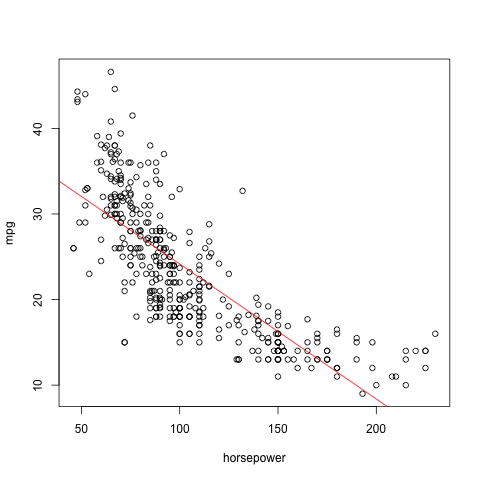
 - c) Use the ``plot()`` function to produce diagnostic plots of the least squares regression fit. Comment on any problems you see with the fit.
    >```r
    >png("ch3_ex8_c.png")
    >par(mfrow = c(2, 2))
    >plot(fit)
    >dev.off()
    >```
    >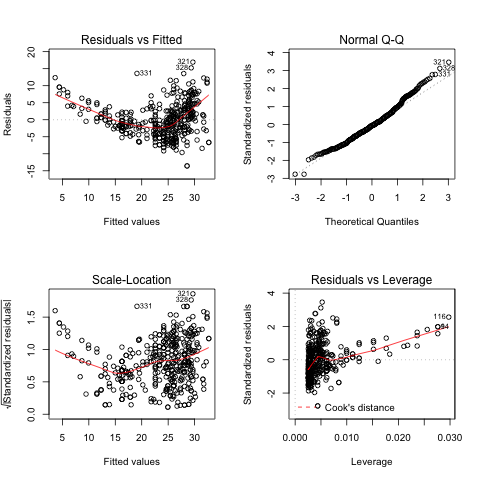
    > Se puede observar que la distribución no es lineal, además de que en los residuales hay punto muy lejanos que introducen erros.

9. This question involves the use of multiple linear regression on the ``Auto`` data set.
 - a) Produce a scatterplot matrix which includes all of the variables in the data set.
    > ```r
    > png("ch3_ex9_ca.png")
    >pairs(auto)
    >dev.off()
    > ```
    >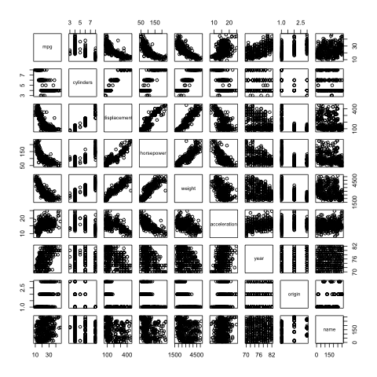
 - b) Compute the matrix of correlations between the variables using the function ```cor()```. You will need to exclude the name variable, which is qualitative.
    >```r
    >cor(auto[-9])
    >```
    > |              | mpg        | cylinders  | displacement | horsepower | weight     | acceleration | year       | origin     |
    >|--------------|------------|------------|--------------|------------|------------|--------------|------------|------------|
    >| mpg          | 1.0000000  | -0.7776175 | -0.8051269   | -0.7784268 | -0.8322442 | 0.4233285    | 0.5805410  | 0.5652088  |
    >| cylinders    | -0.7776175 | 1.0000000  | 0.9508233    | 0.8429834  | 0.8975273  | -0.5046834   | -0.3456474 | -0.5689316 |
    >| displacement | -0.8051269 | 0.9508233  | 1.0000000    | 0.8972570  | 0.9329944  | -0.5438005   | -0.3698552 | -0.6145351 |
    >| horsepower   | -0.7784268 | 0.8429834  | 0.8972570    | 1.0000000  | 0.8645377  | -0.6891955   | -0.4163615 | -0.4551715 |
    >| weight       | -0.8322442 | 0.8975273  | 0.9329944    | 0.8645377  | 1.0000000  | -0.4168392   | -0.3091199 | -0.5850054 |
    >| acceleration | 0.4233285  | -0.5046834 | -0.5438005   | -0.6891955 | -0.4168392 | 1.0000000    | 0.2903161  | 0.2127458  |
    >| year         | 0.5805410  | -0.3456474 | -0.3698552   | -0.4163615 | -0.3091199 | 0.2903161    | 1.0000000  | 0.1815277  |
    >| origin       | 0.5652088  | -0.5689316 | -0.6145351   | -0.4551715 | -0.5850054 | 0.2127458    | 0.1815277  | 1.0000000  |

 - c) Use the ``lm()`` function to perform a multiple linear regression with ``mpg`` as the response and all other variables except name as the predictors. Use the ``summary()`` function to print the results.  
    >```r
    >fit.all = lm(mpg ~ . - name, data = auto)
    >summary(fit.all)
    >```
    >```
    >
    >Call:
    >lm(formula = mpg ~ . - name, data = auto)
    >
    >Residuals:
    >    Min      1Q  Median      3Q     Max
    >-9.5903 -2.1565 -0.1169  1.8690 13.0604
    >
    >Coefficients:
    >               Estimate Std. Error t value Pr(>|t|)    
    >(Intercept)  -17.218435   4.644294  -3.707  0.00024 ***
    >cylinders     -0.493376   0.323282  -1.526  0.12780    
    >displacement   0.019896   0.007515   2.647  0.00844 **
    >horsepower    -0.016951   0.013787  -1.230  0.21963    
    >weight        -0.006474   0.000652  -9.929  < 2e-16 ***
    >acceleration   0.080576   0.098845   0.815  0.41548    
    >year           0.750773   0.050973  14.729  < 2e-16 ***
    >origin         1.426141   0.278136   5.127 4.67e-07 ***
    >---
    >Signif. codes:  0 '***' 0.001 '**' 0.01 '*' 0.05 '.' 0.1 ' ' 1
    >
    >Residual standard error: 3.328 on 384 degrees of freedom
    >Multiple R-squared:  0.8215,	Adjusted R-squared:  0.8182
    >F-statistic: 252.4 on 7 and 384 DF,  p-value: < 2.2e-16
    >
    >```

    Comment on the output. For instance:  
    1. Is there a relationship between the predictors and the re- sponse?
    > Parece sí haber una relación, la R^2 indica que se está explicando el 82.15% de la varianza de los datos, lo cual es bueno.

    2. Which predictors appear to have a statistically significant relationship to the response?
    > No todos los predictores están relacionados con la respuesta, solo weight, year, origin y en menor medida displacement.

    3. What does the coefficient for the year variable suggest?
    > Nos dice que entre más reciente el auto más millas podrá recorrer en promedio.

 - d) Use the ``plot()`` function to produce diagnostic plots of the linear regression fit. Comment on any problems you see with the fit. Do the residual plots suggest any unusually large outliers? Does the leverage plot identify any observations with unusually high leverage?
    > ```r
    > png("ch3_ex9_d.png")
    >par(mfrow = c(2, 2))
    >plot(fit.all)
    >dev.off()
    > ```
    > 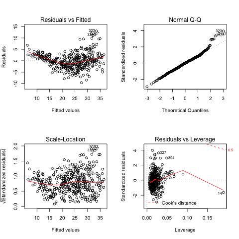
    > Sí, la observación 14 tiene demasiado leverage.

 - e) Use the ``*`` and ``:`` symbols to fit linear regression models with interaction effects. Do any interactions appear to be statistically significant?
    >```r
    >fit.cor = lm(mpg~cylinders*displacement+displacement:weight)
    >summary(fit.cor)
    >```
    >```
    >Call:
    >lm(formula = mpg ~ cylinders * displacement + displacement:weight)
    >
    >Residuals:
    >     Min       1Q   Median       3Q      Max
    >-16.1786  -2.5758  -0.2657   2.1653  19.6874
    >
    >Coefficients:
    >                         Estimate Std. Error t value Pr(>|t|)    
    >(Intercept)             5.005e+01  2.361e+00  21.203  < 2e-16 ***
    >cylinders              -3.295e+00  5.760e-01  -5.721 2.13e-08 ***
    >displacement           -1.126e-01  1.692e-02  -6.653 9.82e-11 ***
    >cylinders:displacement  1.639e-02  2.376e-03   6.898 2.16e-11 ***
    >displacement:weight    -1.043e-05  2.795e-06  -3.731 0.000219 ***
    >---
    >Signif. codes:  0 '***' 0.001 '**' 0.01 '*' 0.05 '.' 0.1 ' ' 1
    >
    >Residual standard error: 4.381 on 387 degrees of freedom
    >Multiple R-squared:  0.6881,	Adjusted R-squared:  0.6849
    >F-statistic: 213.5 on 4 and 387 DF,  p-value: < 2.2e-16
    >
    >```
    > Todas las relaciones utilizadas (aquellas con mayor correlación) parecen ser estadisticamente significativas.

 - f) Try a few different transformations of the variables, such as log(X), √X, X2. Comment on your findings.
    >```r
    >fit.trans = lm(1/mpg~weight+horsepower+weight*horsepower)
    >summary(fit.trans)
    >```
    >```
    >    Call:
    >    lm(formula = 1/mpg ~ weight + horsepower + weight * horsepower)
    >
    >    Residuals:
    >           Min         1Q     Median         3Q        Max
    >    -0.0204680 -0.0043873 -0.0000165  0.0039716  0.0295105
    >
    >    Coefficients:
    >                        Estimate Std. Error t value Pr(>|t|)    
    >    (Intercept)       -4.829e-04  4.281e-03  -0.113  0.91025    
    >    weight             1.092e-05  1.414e-06   7.726 9.58e-14 ***
    >    horsepower         1.370e-04  4.984e-05   2.748  0.00628 **
    >    weight:horsepower  4.335e-09  1.215e-08   0.357  0.72144    
    >    ---
    >    Signif. codes:  0 '***' 0.001 '**' 0.01 '*' 0.05 '.' 0.1 ' ' 1
    >
    >    Residual standard error: 0.007181 on 388 degrees of freedom
    >    Multiple R-squared:  0.8152,	Adjusted R-squared:  0.8138
    >    F-statistic: 570.5 on 3 and 388 DF,  p-value: < 2.2e-16
    >
    >```
    > Al transformar la respuesta a su inversa y usar weight, horsepower y su interacción se logra una R^2 cd 0.8152 y un RSE de 0.007181.
    >```r
    >png("ch3_ex9_f.png")
    >par(mfrow = c(2, 2))
    >plot(fit.trans)
    >dev.off()
    >```
    >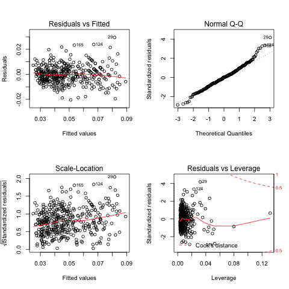
    > Los residuales se ven más simetricos, la normalidad mejoró al inicio pero empeoró al final y el leverage sigue igual.

10. This question should be answered using the Carseats data set.
    >```r
    >library(ISLR)
    >data(Carseats)
    >```

 - a) Fit a multiple regression model to predict Sales using Price,
Urban, and US.
    >```r
    >fit.lm <- lm(Sales ~ Price + Urban + US, data=Carseats)
    >summary(fit.lm)
    >```
    >```
    >Call:
    >lm(formula = Sales ~ Price + Urban + US, data = Carseats)
    >
    >Residuals:
    >    Min      1Q  Median      3Q     Max
    >-6.9206 -1.6220 -0.0564  1.5786  7.0581
    >
    >Coefficients:
    >             Estimate Std. Error t value Pr(>|t|)    
    >(Intercept) 13.043469   0.651012  20.036  < 2e-16 ***
    >Price       -0.054459   0.005242 -10.389  < 2e-16 ***
    >UrbanYes    -0.021916   0.271650  -0.081    0.936    
    >USYes        1.200573   0.259042   4.635 4.86e-06 ***
    >---
    >Signif. codes:  0 '***' 0.001 '**' 0.01 '*' 0.05 '.' 0.1 ' ' 1
    >
    >Residual standard error: 2.472 on 396 degrees of freedom
    >Multiple R-squared:  0.2393,	Adjusted R-squared:  0.2335
    >F-statistic: 41.52 on 3 and 396 DF,  p-value: < 2.2e-16
    >```

 - b) Provide an interpretation of each coefficient in the model. Be
careful—some of the variables in the model are qualitative!
    > Price es estadisticamente significativo, mientras que NO hay diferencia entre si está en un sitio urbano o no, lo que sí importa es si fue hecho en los US.

 - c) Write out the model in equation form, being careful to handle the qualitative variables properly.
    > Sales = 13.043469 -0.054459*Price -0.021916*Urban + 1.200573*US

 - d) For which of the predictors can you reject the null hypothesis H0 :βj =0?
    > Para US y Price.

 - e) Use the ``*`` and ``:`` symbols to fit linear regression models with interaction effects. Do any interactions appear to be statistically significant?
    >```r
    >fit.idk <- lm(Sales ~ Price:US,data=Carseats)
    >summary(fit.idk)
    >```
    >```
    >Call:
    >lm(formula = Sales ~ Price:US, data = Carseats)
    >
    >Residuals:
    >    Min      1Q  Median      3Q     Max
    >-6.8707 -1.6584 -0.0954  1.6308  7.1742
    >
    >Coefficients:
    >             Estimate Std. Error t value Pr(>|t|)    
    >(Intercept) 13.725517   0.618192   22.20   <2e-16 ***
    >Price:USNo  -0.060262   0.005465  -11.03   <2e-16 ***
    >Price:USYes -0.050323   0.005264   -9.56   <2e-16 ***
    >---
    >Signif. codes:  0 '***' 0.001 '**' 0.01 '*' 0.05 '.' 0.1 ' ' 1
    >
    >Residual standard error: 2.473 on 397 degrees of freedom
    >Multiple R-squared:  0.2372,	Adjusted R-squared:  0.2334
    >F-statistic: 61.73 on 2 and 397 DF,  p-value: < 2.2e-16
    >
    >```
    > Parece que la interacción US:Price es significativa

 - f) How well do the models in (a) and (e) fit the data?
    > Muy mal, no llegan a explicar ni el 30% de la varianza.
 - g) Using the model from (e), obtain 95% confidence intervals for the coefficient(s).
    >```r
    >confint(fit.idk)
    >```
    >|             | 2.5 %       | 97.5 %      |
    >|-------------|-------------|-------------|
    >| (Intercept) | 12.51017730 | 14.94085594 |
    >| Price:USNo  | -0.07100616 | -0.04951804 |
    >| Price:USYes | -0.06067089 | -0.03997454 |
 - h) Is there evidence of outliers or high leverage observations in the model from (e)?  
    >```r
    >png("ch3_ex10_h.png")
    >par(mfrow = c(2, 2))
    >plot(fit.idk)
    >dev.off()
    >```
    >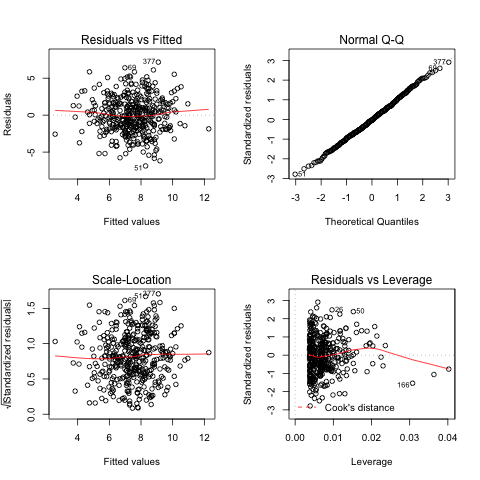
    >Sí, hay algunos outliers.

11. In this problem we will investigate the t-statistic for the null hypoth- esis H0 : β = 0 in simple linear regression without an intercept. To begin, we generate a predictor x and a response y as follows.  
    ```r
    > set.seed (1)
    > x=rnorm(100)
    > y=2*x+rnorm(100)
    ```
  - a) Perform a simple linear regression of y onto x, without an intercept. Report the coefficient estimate βˆ, the standard error of this coefficient estimate, and the t-statistic and p-value associ- ated with the null hypothesis H0 : β = 0. Comment on these results. (You can perform regression without an intercept using the command ``lm(y∼x+0)``.)
    >```r
    >fit = lm(y~x-1)
    >summary(fit)
    >```
    >```    
    >Call:
    >lm(formula = y ~ x - 1)
    >
    >Residuals:
    >    Min      1Q  Median      3Q     Max
    >-1.9154 -0.6472 -0.1771  0.5056  2.3109
    >
    >Coefficients:
    >  Estimate Std. Error t value Pr(>|t|)    
    >x   1.9939     0.1065   18.73   <2e-16 ***
    >---
    >Signif. codes:  0 '***' 0.001 '**' 0.01 '*' 0.05 '.' 0.1 ' ' 1
    >
    >Residual standard error: 0.9586 on 99 degrees of freedom
    >Multiple R-squared:  0.7798,	Adjusted R-squared:  0.7776
    >F-statistic: 350.7 on 1 and 99 DF,  p-value: < 2.2e-16
    >
    >```
    > El p-valor es muy bajo por lo que se dice que se rechaza la hipotesis nula.

 - b) Now perform a simple linear regression of x onto y without an intercept, and report the coefficient estimate, its standard error, and the corresponding t-statistic and p-values associated with the null hypothesis H0 : β = 0. Comment on these results.
    >```r
    >fit = lm(x~y-1)
    >summary(fit)
    >```
    >```
    >Call:
    >lm(formula = x ~ y - 1)
    >
    >Residuals:
    >    Min      1Q  Median      3Q     Max
    >-0.8699 -0.2368  0.1030  0.2858  0.8938
    >
    >Coefficients:
    >  Estimate Std. Error t value Pr(>|t|)    
    >y  0.39111    0.02089   18.73   <2e-16 ***
    >---
    >Signif. codes:  0 '***' 0.001 '**' 0.01 '*' 0.05 '.' 0.1 ' ' 1
    >
    >Residual standard error: 0.4246 on 99 degrees of freedom
    >Multiple R-squared:  0.7798,	Adjusted R-squared:  0.7776
    >F-statistic: 350.7 on 1 and 99 DF,  p-value: < 2.2e-16
    >
    >```
    > El p-valor bajo, por lo que se puede rechazar la hipotesis nula.

  - c)  What is the relationship between the results obtained in (a) and (b)?
    > El auste en ambos es lineal, esto es por que en realidad son la misma pero colocada en distintos ejes.

  - d) For the regression of Y onto X without an intercept, the t- statistic for H0 : β = 0 takes the form βˆ/SE(βˆ), where βˆ is given by (3.38), and where  

      

    (These formulas are slightly different from those given in Sec- tions 3.1.1 and 3.1.2, since here we are performing regression without an intercept.) Show algebraically, and confirm numeri- cally in R, that the t-statistic can be written as  

    
    >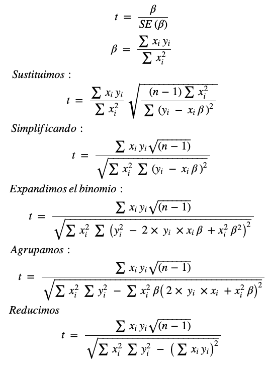
    >```r
    >(sqrt(length(x)-1) * sum(x*y)) / (sqrt(sum(x*x) * sum(y*y) - (sum(x*y))^2))
    >```
    >```
    >18.7259319374486
    >```
 - e) Using the results from (d), argue that the t-statistic for the re- gression of y onto x is the same as the t-statistic for the regression of x onto y.
    > Las funciones f(x,y) y f(y,x) son intercambiables.  

 - f) In R, show that when regression is performed with an intercept, the t-statistic for H0 : β1 = 0 is the same for the regression of y onto x as it is for the regression of x onto y.
    >```r
    >fit1 = lm(y~x)
    >fit2 = lm(x~y)
    >summary(fit1)
    >summary(fit2)
    >```
    >```
    >Call:
    >lm(formula = y ~ x)
    >
    >Residuals:
    >    Min      1Q  Median      3Q     Max
    >-1.8768 -0.6138 -0.1395  0.5394  2.3462
    >
    >Coefficients:
    >            Estimate Std. Error t value Pr(>|t|)    
    >(Intercept) -0.03769    0.09699  -0.389    0.698    
    >x            1.99894    0.10773  18.556   <2e-16 ***
    >---
    >Signif. codes:  0 '***' 0.001 '**' 0.01 '*' 0.05 '.' 0.1 ' ' 1
    >
    >Residual standard error: 0.9628 on 98 degrees of freedom
    >Multiple R-squared:  0.7784,	Adjusted R-squared:  0.7762
    >F-statistic: 344.3 on 1 and 98 DF,  p-value: < 2.2e-16
    >
    >Call:
    >lm(formula = x ~ y)
    >
    >Residuals:
    >     Min       1Q   Median       3Q      Max
    >-0.90848 -0.28101  0.06274  0.24570  0.85736
    >
    >Coefficients:
    >            Estimate Std. Error t value Pr(>|t|)    
    >(Intercept)  0.03880    0.04266    0.91    0.365    
    >y            0.38942    0.02099   18.56   <2e-16 ***
    >---
    >Signif. codes:  0 '***' 0.001 '**' 0.01 '*' 0.05 '.' 0.1 ' ' 1
    >
    >Residual standard error: 0.4249 on 98 degrees of freedom
    >Multiple R-squared:  0.7784,	Adjusted R-squared:  0.7762
    >F-statistic: 344.3 on 1 and 98 DF,  p-value: < 2.2e-16
    >
    >```
    > La estadistica t y el p-valor son iguales.

12. This problem involves simple linear regression without an intercept.
 - a) Recall that the coefficient estimate βˆ for the linear regression of Y onto X without an intercept is given by (3.38). Under what circumstance is the coefficient estimate for the regression of X onto Y the same as the coefficient estimate for the regression of Y onto X?
    > Para que esto se cumpla, la suma de los cuadrados de los y-valores observados debe de ser igual a la suma de los x-valores observados.

 - b) Generate an example in R with n = 100 observations in which the coefficient estimate for the regression of X onto Y is different from the coefficient estimate for the regression of Y onto X.
    > ```r
    > set.seed(1)
    >x = rnorm(100)
    >y = x+rnorm(100)
    >reg1 = lm(y~x-1)
    >reg2 = lm(x~y-1)
    >summary(reg1)
    >summary(reg2)
    > ```
    > ```
    >
    >Call:
    >lm(formula = y ~ x - 1)
    >
    >Residuals:
    >    Min      1Q  Median      3Q     Max
    >-1.9154 -0.6472 -0.1771  0.5056  2.3109
    >
    >Coefficients:
    >  Estimate Std. Error t value Pr(>|t|)    
    >x   4.9939     0.1065    46.9   <2e-16 ***
    >---
    >Signif. codes:  0 '***' 0.001 '**' 0.01 '*' 0.05 '.' 0.1 ' ' 1
    >
    >Residual standard error: 0.9586 on 99 degrees of freedom
    >Multiple R-squared:  0.9569,	Adjusted R-squared:  0.9565
    >F-statistic:  2200 on 1 and 99 DF,  p-value: < 2.2e-16
    >
    >Call:
    >lm(formula = x ~ y - 1)
    >
    >Residuals:
    >     Min       1Q   Median       3Q      Max
    >-0.42234 -0.09331  0.04202  0.11837  0.35994
    >
    >Coefficients:
    >  Estimate Std. Error t value Pr(>|t|)    
    >y 0.191621   0.004086    46.9   <2e-16 ***
    >---
    >Signif. codes:  0 '***' 0.001 '**' 0.01 '*' 0.05 '.' 0.1 ' ' 1
    >
    >Residual standard error: 0.1878 on 99 degrees of freedom
    >Multiple R-squared:  0.9569,	Adjusted R-squared:  0.9565
    >F-statistic:  2200 on 1 and 99 DF,  p-value: < 2.2e-16
    >
    > ```
    >Se puede apreciar de los resumenes que los coeficientes son diferentes.

 - c) Generate an example in R with n = 100 observations in which the coefficient estimate for the regression of X onto Y is the same as the coefficient estimate for the regression of Y onto X.
    >```r
    >set.seed(1)
    >x = rnorm(100)
    >y = -sample(x,100)
    >reg1.a = lm(y~x-1)
    >reg2.a = lm(x~y-1)
    >summary(reg1.a)
    >summary(reg2.a)
    >```
    >```
    >
    >Call:
    >lm(formula = y ~ x - 1)
    >
    >Residuals:
    >    Min      1Q  Median      3Q     Max
    >-2.2833 -0.6945 -0.1140  0.4995  2.1665
    >
    >Coefficients:
    >  Estimate Std. Error t value Pr(>|t|)
    >x  0.07768    0.10020   0.775     0.44
    >
    >Residual standard error: 0.9021 on 99 degrees of freedom
    >Multiple R-squared:  0.006034,	Adjusted R-squared:  -0.004006
    >F-statistic: 0.601 on 1 and 99 DF,  p-value: 0.4401
    >
    >Call:
    >lm(formula = x ~ y - 1)
    >
    >Residuals:
    >    Min      1Q  Median      3Q     Max
    >-2.2182 -0.4969  0.1595  0.6782  2.4017
    >
    >Coefficients:
    >  Estimate Std. Error t value Pr(>|t|)
    >y  0.07768    0.10020   0.775     0.44
    >
    >Residual standard error: 0.9021 on 99 degrees of freedom
    >Multiple R-squared:  0.006034,	Adjusted R-squared:  -0.004006
    >F-statistic: 0.601 on 1 and 99 DF,  p-value: 0.4401
    >
    >```
    >```r
    >sum(x^2) ==sum(y^2)
    >```
    >```
    >TRUE
    >```
    > Se puede ver que son iguales los coeficientes, errores y estadisticas. Al igual que la suma de los cuadrados, por lo que se había discutido anteriormente.

13. In this exercise you will create some simulated data and will fit simple linear regression models to it. Make sure to use set.seed(1) prior to starting part (a) to ensure consistent results.
 - a) Using the rnorm() function, create a vector, x, containing 100 observations drawn from a N(0,1) distribution. This represents a feature, X.
    >```r
    >set.seed(1)
    >x=rnorm(100)
    >```

 - b)Using the rnorm() function, create a vector, eps, containing 100 observations drawn from a N(0,0.25) distribution i.e. a normal distribution with mean zero and variance 0.25.
    >```r
    >eps = rnorm(100, 0, sqrt(0.25))
    >```

 - c) Using x and eps, generate a vector y according to the model

      (3.39)

     What is the length of the vector y? What are the values of β0 and β1 in this linear model?
     >```r
     >y = -1 + 0.5*x + eps
     >length(y)
     >```
     > Tiene longitud 100.

 - d) Create a scatterplot displaying the relationship between x and y. Comment on what you observe.
    >```r
    >png("ch3_ex13_d.png")
    >plot(x,y)
    >dev.off()
    >```
    >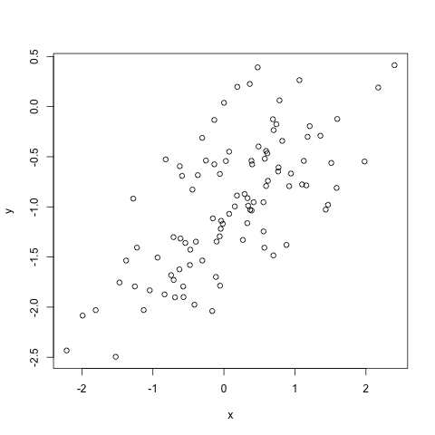
    > Se puede ver una relación lineal positiva, aunque también se puede ver que los datos están dispersados, esto por la varianza dada.

 - e) Fit a least squares linear model to predict y using x. Comment on the model obtained. How do βˆ0 and βˆ1 compare to β0 and β1?
    >```r
    >fit = lm(y~x)
    >summary(fit)
    >```
    >```
    >    Call:
    >    lm(formula = y ~ x)
    >
    >    Residuals:
    >         Min       1Q   Median       3Q      Max
    >    -0.93842 -0.30688 -0.06975  0.26970  1.17309
    >
    >    Coefficients:
    >                Estimate Std. Error t value Pr(>|t|)    
    >    (Intercept) -1.01885    0.04849 -21.010  < 2e-16 ***
    >    x            0.49947    0.05386   9.273 4.58e-15 ***
    >    ---
    >    Signif. codes:  0 '***' 0.001 '**' 0.01 '*' 0.05 '.' 0.1 ' ' 1
    >
    >    Residual standard error: 0.4814 on 98 degrees of freedom
    >    Multiple R-squared:  0.4674,	Adjusted R-squared:  0.4619
    >    F-statistic: 85.99 on 1 and 98 DF,  p-value: 4.583e-15
    >
    >```
    > Se puede ver que el oceficiente es cercano a 0.5 y la intercepción es cercano a 1, mientras que de  la estadistica F el p-valor es casi 0, rechazando la hipótesis nula.

 - f) Display the least squares line on the scatterplot obtained in (d). Draw the population regression line on the plot, in a different color. Use the legend() command to create an appropriate legend.
    >```r
    >png("ch3_ex13_f.png")
    >plot(x, y)
    >abline(fit, lwd=3, col=1)
    >abline(-1, 0.5, lwd=3, col=2)
    >legend(-1, legend = c("Fit", "Funcion"), col=1:2, lwd=4)
    >dev.off()
    >```
    >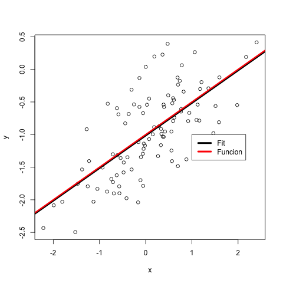

 - g) Now fit a polynomial regression model that predicts y using x and x2. Is there evidence that the quadratic term improves the model fit? Explain your answer.
    >```r
    >ajuste = lm(y~x+I(x^2))
    >summary(ajuste)
    >```
    >
    >```
    >    Call:
    >    lm(formula = y ~ x + I(x^2))
    >
    >    Residuals:
    >         Min       1Q   Median       3Q      Max
    >    -0.98252 -0.31270 -0.06441  0.29014  1.13500
    >
    >    Coefficients:
    >                Estimate Std. Error t value Pr(>|t|)    
    >    (Intercept) -0.97164    0.05883 -16.517  < 2e-16 ***
    >    x            0.50858    0.05399   9.420  2.4e-15 ***
    >    I(x^2)      -0.05946    0.04238  -1.403    0.164    
    >    ---
    >    Signif. codes:  0 '***' 0.001 '**' 0.01 '*' 0.05 '.' 0.1 ' ' 1
    >
    >    Residual standard error: 0.479 on 97 degrees of freedom
    >    Multiple R-squared:  0.4779,	Adjusted R-squared:  0.4672
    >    F-statistic:  44.4 on 2 and 97 DF,  p-value: 2.038e-14
    >
    >```
    > Se puede ver que el termino cuadrado no ajusta bien al modelo.

 - h) Repeat (a)–(f) after modifying the data generation process in such a way that there is less noise in the data. The model (3.39) should remain the same. You can do this by decreasing the vari- ance of the normal distribution used to generate the error term ε in (b). Describe your results.
    >```r
    >set.seed(1)
    >eps.1 = rnorm(100, 0, 0.125)  
    >x.1 = rnorm(100)
    >y.1 = -1 + 0.5*x.1 + eps.1
    >plot(x.1, y.1)
    >```
    >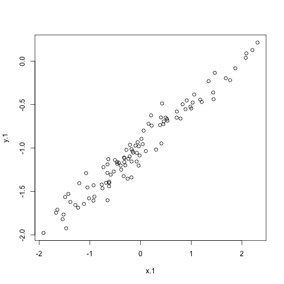
    >```r
    >ajuste_1= lm(y_1~x_1)   #hacemos un ajuste de curva entre los >predictores y_1 y x_1
    >summary(ajuste_1)
    ```
    >```
    >Call:
    >lm(formula = y.1 ~ x.1)
    >
    >Residuals:
    >     Min       1Q   Median       3Q      Max
    >-0.29052 -0.07545  0.00067  0.07288  0.28664
    >
    >Coefficients:
    >            Estimate Std. Error t value Pr(>|t|)    
    >(Intercept) -0.98639    0.01129  -87.34   <2e-16 ***
    >x.1          0.49988    0.01184   42.22   <2e-16 ***
    >---
    >Signif. codes:  0 '***' 0.001 '**' 0.01 '*' 0.05 '.' 0.1 ' ' 1
    >
    >Residual standard error: 0.1128 on 98 degrees of freedom
    >Multiple R-squared:  0.9479,	Adjusted R-squared:  0.9474
    >F-statistic:  1782 on 1 and 98 DF,  p-value: < 2.2e-16
    >
    >```
    > Los coeficientes encontrados por la regresión son muy cercanos a los establecidos por ña función.
    > ```r
    > png("ch3_ex13_i.png")
    >plot(x.1, y.1)
    >abline(fit, lwd=1, col=1)
    >abline(-1, 0.5, lwd=1, col=2)
    >legend(-1,0, legend = c("Fit", "Funcion"), col=1:2, lwd=6)
    >dev.off()
    > ```
    > 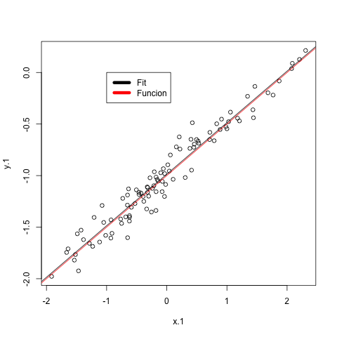
    > El error a disminuido, ya que redujimos la varianza.

 - i) Repeat (a)–(f) after modifying the data generation process in such a way that there is more noise in the data. The model (3.39) should remain the same. You can do this by increasing the variance of the normal distribution used to generate the error term ε in (b). Describe your results.
    >```r
    >png("ch3_ex13_ii.png")
    >set.seed(1)
    >eps.2 = rnorm(100, 0, 0.5)
    >x.2 = rnorm(100)
    >y.2 = -1 + 0.5*x.2 + eps.2
    >plot(x.2, y.2)
    >dev.off()
    >
    >fit2= lm(y.2~x.2)
    >summary(fit2)
    >
    >png("ch3_ex13_iii.png")
    >plot(x.2, y.2)
    >abline(fit, lwd=1, col=1)
    >abline(-1, 0.5, lwd=1, col=2)
    >legend(-1,0, legend = c("Fit", "Funcion"), col=1:2, lwd=6)
    >dev.off()
    >```
    >```
    >pdf: 2
    >Call:
    >lm(formula = y.2 ~ x.2)
    >
    >Residuals:
    >     Min       1Q   Median       3Q      Max
    >-1.16208 -0.30181  0.00268  0.29152  1.14658
    >
    >Coefficients:
    >                Estimate Std. Error t value Pr(>|t|)    
    >(Intercept) -0.94557    0.04517  -20.93   <2e-16 ***
    >x.2          0.49953    0.04736   10.55   <2e-16 ***
    >---
    >Signif. codes:  0 '***' 0.001 '**' 0.01 '*' 0.05 '.' 0.1 ' ' 1
    >
    >Residual standard error: 0.4514 on 98 degrees of freedom
    >Multiple R-squared:  0.5317,	Adjusted R-squared:  0.5269
    >F-statistic: 111.2 on 1 and 98 DF,  p-value: < 2.2e-16
    >pdf: 2
    >
    >```
    >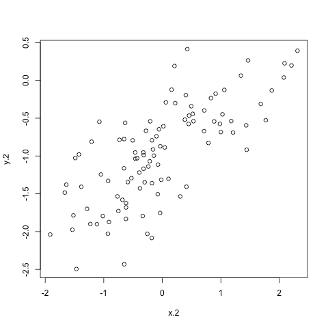  
    >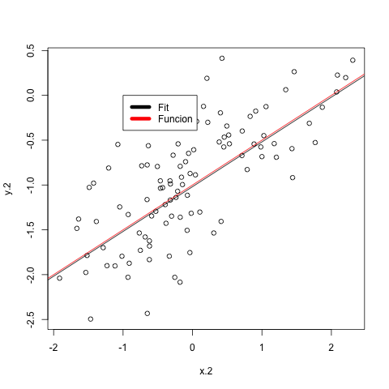  
    > Se puede observar que el error a aumentado en proporcion de lo que cambiamos en la función.

 - j) What are the confidence intervals for β0 and β1 based on the original data set, the noisier data set, and the less noisy data set? Comment on your results.
    >```r
    >confint(fit)
    >```
    >|             | 2.5 %      | 97.5 %     |
    >|-------------|------------|------------|
    >| (Intercept) | -1.1150804 | -0.9226122 |
    >| x           | 0.3925794  | 0.6063602  |  
    >
    >```r
    >confint(fit1)
    >```  
    >
    >|             | 2.5 %     | 97.5 %     |
    >|-------------|-----------|------------|
    >| (Intercept) | -1.008805 | -0.9639819 |
    >| x.1         | 0.476387  | 0.5233799  |  
    >
    >```r
    >confint(fit2)
    >```
    >
    >|             | 2.5 %      | 97.5 %     |
    >|-------------|------------|------------|
    >| (Intercept) | -1.0352203 | -0.8559276 |
    >| x.2         | 0.4055479  | 0.5935197  |
    >
    > El intervalo de confianza es mayor entre mayor sea la varianza.
14. This problem focuses on the collinearity problem.
 - a) Perform the following commands in R:
    ```r
    > set.seed(1)
    > x1=runif(100)
    > x2=0.5*x1+rnorm(100)/10
    > y=2+2*x1+0.3*x2+rnorm(100)
    ```
 The last line corresponds to creating a linear model in which y is a function of x1 and x2. Write out the form of the linear model. What are the regression coefficients?
    > Los errores son βo = 2, β1 = 2, β2 = 0.3 y el error es rnorm(100).
 - b) What is the correlation between x1 and x2? Create a scatterplot displaying the relationship between the variables.
    >```r
    >cor(x1, x2)
    >```
    >```
    >0.835121242463113
    >```
    >```r
    >png("ch3_ex14_b.png")
    >plot(x1, x2)
    >dev.off()
    >```
    >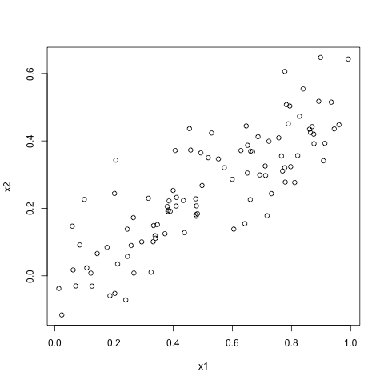
    > La correlación es positiva.

 - c) Using this data, fit a least squares regression to predict y using x1 and x2. Describe the results obtained. What are βˆ0, βˆ1, and βˆ2? How do these relate to the true β0, β1, and β2? Can you reject the null hypothesis H0 : β1 = 0? How about the null hypothesis H0 : β2 = 0?
    >```r
    >fit_14 = lm(y~x1+x2)
    >summary(fit_14)
    >```
    >```
    >Call:
    >lm(formula = y ~ x1 + x2)
    >
    >Residuals:
    >    Min      1Q  Median      3Q     Max
    >-2.8311 -0.7273 -0.0537  0.6338  2.3359
    >
    >Coefficients:
    >            Estimate Std. Error t value Pr(>|t|)    
    >(Intercept)   2.1305     0.2319   9.188 7.61e-15 ***
    >x1            1.4396     0.7212   1.996   0.0487 *  
    >x2            1.0097     1.1337   0.891   0.3754    
    >---
    >Signif. codes:  0 '***' 0.001 '**' 0.01 '*' 0.05 '.' 0.1 ' ' 1
    >
    >Residual standard error: 1.056 on 97 degrees of freedom
    >Multiple R-squared:  0.2088,	Adjusted R-squared:  0.1925
    >F-statistic:  12.8 on 2 and 97 DF,  p-value: 1.164e-05
    >
    >```
    > Los coeficientes obtenidos cambian significativamente, parece ser que el unicopredictor significativo es x1 segun su p-valor.

 - d) Now fit a least squares regression to predict y using only x1. Comment on your results. Can you reject the null hypothesis H0 :β1 =0?
    >```r
    >fitx1 = lm(y~x1)
    >summary(fitx1)
    >```
    >```
    >Call:
    >lm(formula = y ~ x1)
    >
    >Residuals:
    >     Min       1Q   Median       3Q      Max
    >-2.89495 -0.66874 -0.07785  0.59221  2.45560
    >
    >Coefficients:
    >            Estimate Std. Error t value Pr(>|t|)    
    >(Intercept)   2.1124     0.2307   9.155 8.27e-15 ***
    >x1            1.9759     0.3963   4.986 2.66e-06 ***
    >---
    >Signif. codes:  0 '***' 0.001 '**' 0.01 '*' 0.05 '.' 0.1 ' ' 1
    >
    >Residual standard error: 1.055 on 98 degrees of freedom
    >Multiple R-squared:  0.2024,	Adjusted R-squared:  0.1942
    >F-statistic: 24.86 on 1 and 98 DF,  p-value: 2.661e-06
    >
    >```
    >Se puede rechazar la hipotesis nula puesto que el p-valor es muy bajo.
 - e) Now fit a least squares regression to predict y using only x2. Comment on your results. Can you reject the null hypothesis H0 :β1 =0?
    >```r
    >fitx2 = lm(y~x1)
    >summary(fitx2)
    >```
    >```
    >Call:
    >lm(formula = y ~ x2)
    >
    >Residuals:
    >     Min       1Q   Median       3Q      Max
    >-2.62687 -0.75156 -0.03598  0.72383  2.44890
    >
    >Coefficients:
    >            Estimate Std. Error t value Pr(>|t|)    
    >(Intercept)   2.3899     0.1949   12.26  < 2e-16 ***
    >x1            2.8996     0.6330    4.58 1.37e-05 ***
    >---
    >Signif. codes:  0 '***' 0.001 '**' 0.01 '*' 0.05 '.' 0.1 ' ' 1
    >
    >Residual standard error: 1.072 on 98 degrees of freedom
    >Multiple R-squared:  0.1763,	Adjusted R-squared:  0.1942
    >F-statistic: 20.98 on 1 and 98 DF,  p-value: 2.661e-06
    >
    >```
    > En este caso la hipotesis nula es rechazada por que el p-valor es casi 0.

 - f) Do the results obtained in (c)–(e) contradict each other? Explain your answer.
  >Se podría pensar que sí, sin embargo, en el c es tomando en cuenta tambien la variable x1, así que no.

 - g) Now suppose we obtain one additional observation, which was unfortunately mismeasured.
    ```r
    > x1=c(x1, 0.1)
    > x2=c(x2, 0.8)
    > y=c(y,6)
    ```
 Re-fit the linear models from (c) to (e) using this new data. What effect does this new observation have on the each of the models? In each model, is this observation an outlier? A high-leverage point? Both? Explain your answers.
    >```r
    >fit.new = lm(y~x1+x2)
    >summary(fit.new)
    >```
    >
    >```
    >Call:
    >lm(formula = y ~ x1 + x2)
    >
    >Residuals:
    >     Min       1Q   Median       3Q      Max
    >-2.73348 -0.69318 -0.05263  0.66385  2.30619
    >
    >Coefficients:
    >            Estimate Std. Error t value Pr(>|t|)    
    >(Intercept)   2.2267     0.2314   9.624 7.91e-16 ***
    >x1            0.5394     0.5922   0.911  0.36458    
    >x2            2.5146     0.8977   2.801  0.00614 **
    >---
    >Signif. codes:  0 '***' 0.001 '**' 0.01 '*' 0.05 '.' 0.1 ' ' 1
    >
    >Residual standard error: 1.075 on 98 degrees of freedom
    >Multiple R-squared:  0.2188,	Adjusted R-squared:  0.2029
    >F-statistic: 13.72 on 2 and 98 DF,  p-value: 5.564e-06
    >
    >```
    > En este caso la unica variable importante es x2.
    >```r
    >fitx.new1 = lm(y~x1)
    >summary(fitx.new1)
    >fitx.new2 = lm(y~x2)
    >summary(fitx.new2)
    >```
    >
    >```
    >    Call:
    >    lm(formula = y ~ x1)
    >
    >    Residuals:
    >        Min      1Q  Median      3Q     Max
    >    -2.8897 -0.6556 -0.0909  0.5682  3.5665
    >
    >    Coefficients:
    >                Estimate Std. Error t value Pr(>|t|)    
    >    (Intercept)   2.2569     0.2390   9.445 1.78e-15 ***
    >    x1            1.7657     0.4124   4.282 4.29e-05 ***
    >    ---
    >    Signif. codes:  0 '***' 0.001 '**' 0.01 '*' 0.05 '.' 0.1 ' ' 1
    >
    >    Residual standard error: 1.111 on 99 degrees of freedom
    >    Multiple R-squared:  0.1562,	Adjusted R-squared:  0.1477
    >    F-statistic: 18.33 on 1 and 99 DF,  p-value: 4.295e-05
    >
    >    Call:
    >    lm(formula = y ~ x2)
    >
    >    Residuals:
    >         Min       1Q   Median       3Q      Max
    >    -2.64729 -0.71021 -0.06899  0.72699  2.38074
    >
    >    Coefficients:
    >                Estimate Std. Error t value Pr(>|t|)    
    >    (Intercept)   2.3451     0.1912  12.264  < 2e-16 ***
    >    x2            3.1190     0.6040   5.164 1.25e-06 ***
    >    ---
    >    Signif. codes:  0 '***' 0.001 '**' 0.01 '*' 0.05 '.' 0.1 ' ' 1
    >
    >    Residual standard error: 1.074 on 99 degrees of freedom
    >    Multiple R-squared:  0.2122,	Adjusted R-squared:  0.2042
    >    F-statistic: 26.66 on 1 and 99 DF,  p-value: 1.253e-06
    >
    >```
    > Se observa lo mismo que en el ejercicio anterior, por separado los predictores parecen ser importantes, pero al verlos juntos se ve que no es así.

15. This problem involves the Boston data set, which we saw in the lab for this chapter. We will now try to predict per capita crime rate using the other variables in this data set. In other words, per capita crime rate is the response, and the other variables are the predictors.
 - a) For each predictor, fit a simple linear regression model to predict the response. Describe your results. In which of the models is there a statistically significant association between the predictor and the response? Create some plots to back up your assertions.
 - b) Fit a multiple regression model to predict the response using all of the predictors. Describe your results. For which predictors can we reject the null hypothesis H0 : βj = 0?
 - c) How do your results from (a) compare to your results from (b)? Create a plot displaying the univariate regression coefficients from (a) on the x-axis, and the multiple regression coefficients from (b) on the y-axis. That is, each predictor is displayed as a single point in the plot. Its coefficient in a simple linear regres- sion model is shown on the x-axis, and its coefficient estimate in the multiple linear regression model is shown on the y-axis.
 - d) Is there evidence of non-linear association between any of the predictors and the response? To answer this question, for each predictor X, fit a model of the form

     
