# Tarea 03

_Iván Eduardo Sedeño Jiménez_

## Teoría  

1. We perform best subset, forward stepwise, and backward stepwise selection on a single data set. For each approach, we obtain p + 1 models, containing 0, 1, 2, . . . , p predictors. Explain your answers:
 - a) Which of the three models with k predictors has the smallest training RSS?
    > Best subset tendrá el menor RSS de entrenamiento, puesto que en los otros dos quedan varios mdelos sin probarse, sin embargo, con best subset se prueba una mayor cantidad de subsets.

 - b) Which of the three models with k predictors has the smallest test RSS?
    > Esto es difcícil de predecir, ya que best subset puede llegar a sobreajustar al set de entrenamiento, pero ambos forward y backward selection no exploran todos los modelos posibles. Sin embargo, es más probable que best subset tenga el menor RSS en el set de test.

 - c) True or False:
    1. The predictors in the k-variable model identified by forward stepwise are a subset of the predictors in the (k+1)-variable model identified by forward stepwise selection.
       > Verdadero

    2. The predictors in the k-variable model identified by back- ward stepwise are a subset of the predictors in the (k + 1)- variable model identified by backward stepwise selection.
       > Verdadero

    3. The predictors in the k-variable model identified by back- ward stepwise are a subset of the predictors in the (k + 1)- variable model identified by forward stepwise selection.
       > Falso

    4. The predictors in the k-variable model identified by forward stepwise are a subset of the predictors in the (k+1)-variable model identified by backward stepwise selection.
       > Falso

    5. The predictors in the k-variable model identified by best subset are a subset of the predictors in the (k + 1)-variable model identified by best subset selection.
       > Falso

2. For parts (a) through (c), indicate which of i. through iv. is correct. Justify your answer.
 - a) The lasso, relative to least squares, is:
    1. More flexible and hence will give improved prediction accuracy when its increase in bias is less than its decrease in variance.
    2. More flexible and hence will give improved prediction accuracy when its increase in variance is less than its decrease in bias.
    3. Less flexible and hence will give improved prediction accuracy when its increase in bias is less than its decrease in variance.
    4. Less flexible and hence will give improved prediction accuracy when its increase in variance is less than its decrease in bias.  

    > La no. 3 es cierta, ya que se penaliza el tamaño.

 - b) Repeat (a) for ridge regression relative to least squares.
    > La no.3 es cierta ya que al igual que lasso penaliza el tamaño, solo que esta no selecciona varibales.

 - c) Repeat (a) for non-linear methods relative to least squares.
    > La no.2 es cierta, al ser no lineal, es más flexible y aumenta su varianza.

3. Suppose we estimate the regression coefficients in a linear regression model by minimizing  
 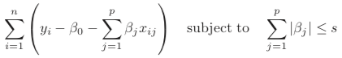  
    for a particular value of s. For parts (a) through (e), indicate which of i. through v. is correct. Justify your answer.
 - a)As we increase s from 0, the training RSS will:
    1. Increase initially, and then eventually start decreasing in an inverted U shape.
    2. Decrease initially, and then eventually start increasing in a U shape.
    3. Steadily increase.
    4. Steadily decrease.
    5. Remain constant.  

    > La no.4 es cierta, entre más se aumente __s__, el modelo tendrá menos restricciones, lo que le permitirá ajustarse mejor al set de entrenamiento.

 - b) Repeat (a) for test RSS.
    > La no. 2 es cierta, inicialmente el modelo al tener menos restricciones puede ajustarse mejor a distintos datos, pero al seguir incrementando __s__, esta comenzará a sobreajustarse al set de training, empeorando el RSS para el set de test.

 - c) Repeat (a) for variance.
    > La no. 3 es cierta, tener menos restringido el modelo da espacio a mayor varianza.

 - d) Repeat (a) for (squared) bias.
    > La no 4. es cierta, el bias el bias experimentará lo contrario a la varianza.

 - e) Repeat (a) for the irreducible error.
    > La no 5. es cierta, este error es independiente del modelo.

4. Suppose we estimate the regression coefficients in a linear regression model by minimizing  
 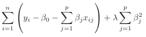  
    for a particular value of λ. For parts (a) through (e), indicate which of i. through v. is correct. Justify your answer.
 - a) As we increase λ from 0, the training RSS will:
    1. Increase initially, and then eventually start decreasing in an inverted U shape.
    2. Decrease initially, and then eventually start increasing in a U shape.
    3. Steadily increase.
    4. Steadily decrease.
    5. Remain constant.
    > La no. 3 escierta, al incrementar λ, las β's se van a 0, incrementando lentamente el error para el ret de training.

 - b) Repeat (a) for test RSS.
    > La no. 2 es cierta, inicialmente el modelo comienza a reducir su overfitting al set de training, pero al seguir aumentando λ el modelo se vuelve demasiado simple, aumentando el RSS.

 - c) Repeat (a) for variance.
    > La no. 4 es cierta, al restringir más el modelo la varianza disminuirá.

 - d) Repeat (a) for (squared) bias.
    > La no. 3 es cierta, ocurre lo contrario a la varianza.

 - e) Repeat (a) for the irreducible error.
    > La no. 5 es cieta, este error es constante.

5. It is well-known that ridge regression tends to give similar coefficient values to correlated variables, whereas the lasso may give quite dif- ferent coefficient values to correlated variables. We will now explore this property in a very simple setting.  
   Suppose that n = 2, p = 2, x11 = x12, x21 = x22. Furthermore, suppose that y1+y2=0 and x11+x21=0 and x12+x22=0, so that the estimate for the intercept in a least squares, ridge regression, or lasso model is zero: βˆ0 = 0.
 - a)Write out the ridge regression optimization problem in this setting.
    > El problema de optimización es minimizar la siguiente ecuación:  
    >   
 - b) Argue that in this setting, the ridge coefficient estimates satisfy βˆ 1 = βˆ 2 .
    > Expandiendo el polinomio anterior:  
    >   
    > Y derivando con respecto a __β_1__ e igualando a 0:  
    >   
    > Igualando x11 = x12 = x1, dividiendo entre 2 y factorizando:  
    >   
    > Sumando  2βˆ_1x_1x_2 y 2βˆ_2x_1x_2 para completar los trinomios:  
    >   
    > Tomando en cuenta las condiciones iniciales, se eliminan los primeros dos terminos del lado izquierdo:  
    >   
    > Se observa que tomando la derivada parcial con respecto a __β_2____ se obtendría la misma ecuación.  
    >   
    > Por lo tanto se observa que la igualdad se cumple:  
    >   

 - c) Write out the lasso optimization problem in this setting.
    > Minimizar la siguiente expresión:
    >   

 - d) Argue that in this setting, the lasso coefficients βˆ1 and βˆ2 are not unique, in other words, there are many possible solutions to the optimization problem in (c). Describe these solutions.  
    > Siguiendo el razonamiento del inciso b,  y observando la derivada con respecto a β se puede observar que
    >   
    > Recordando que dado de graficar Lasso se obtiene un diamante, graficando la optimización se obtendrán lineas paralelas al diamante, siendo solución todas los puntos en que se toquen las lineas con el diamante.

6. We will now explore (6.12) and (6.13) further.
 - a) Consider (6.12) with p = 1. For some choice of y1 and λ > 0, plot (6.12) as a function of β1. Your plot should confirm that (6.12) is solved by (6.14).
    >```r
    >y = 2
    >l = 2
    >bs = seq(-5, 5, 0.1)
    >f = (y - bs)^2 + l * bs^2
    >est.beta = y/(1 + l)
    >est.f = (y - est.beta)^2 + l * est.beta^2
    >png("ch6_ex6_a.png")
    >plot(bs, f, pch = 20, xlab = "Beta", ylab = "Optimization")
    >points(est.beta, est.f, col = 2, pch = 4, lwd = 5, cex = est.beta)
    >dev.off()
    >```
    >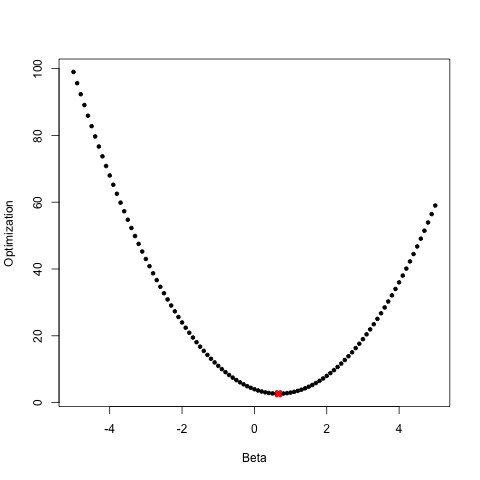  
    >Se puede apreciar claramente que la función se minimiza en β = y/(1 + l)

 - b) Consider (6.13) with p = 1. For some choice of y1 and λ > 0, plot (6.13) as a function of β1. Your plot should confirm that (6.13) is solved by (6.15).
   > ```r
   >y = 2
   >l = 2
   >bs = seq(-5, 5, 0.01)
   >f = (y - bs)^2 + l * abs(bs)
   >est.beta = y - l/2
   >est.f = (y - est.beta)^2 + l * abs(est.beta)
   >png("ch6_ex6_b.png")
   >plot(bs, f, pch = 20, xlab = "Beta", ylab = "Optimization")
   >points(est.beta, est.f, col = 2, pch = 4, lwd = 5, cex = est.beta)
   >dev.off()
   > ```
   >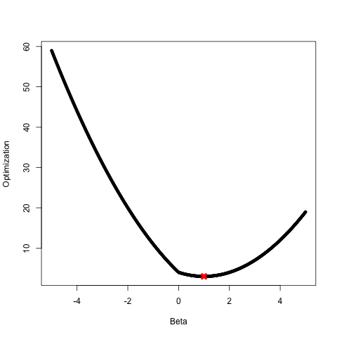  
   > Pudiendose apreciar que la función se minimiza en β = y - l/2

7. We will now derive the Bayesian connection to the lasso and ridge regression discussed in Section 6.2.2.
 - a) Suppose that yi = β0 +(Sum^p_j=1) xi,j βj +εi where ε1, . . . , εn are independent and identically distributed from a N(0,σ^2) distribution. Write out the likelihood for the data.
    >La verosimilitud luce como:  
    >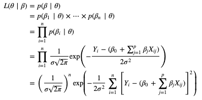  

 - b) Assume the following prior for β: β1, . . . , βp are independent and identically distributed according to a double exponential distribution with mean 0 and common scale parameter b: i.e. p(β) = 1/2b exp(−|β|/b). Write out the posterior for β in this 2b setting.
    >Sustituyendo tomando en cuanta la función de probabilidad mencionada  
    >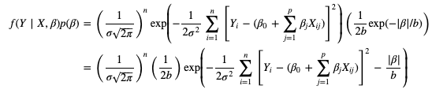

 - c) Argue that the lasso estimate is the mode for β under this pos- terior distribution.
    > __Complete__

 - d) Now assume the following prior for β: β1, . . . , βp are independent and identically distributed according to a normal distribution with mean zero and variance c. Write out the posterior for β in this setting.
    > __Complete__

 - e) Argue that the ridge regression estimate is both the mode and the mean for β under this posterior distribution.

## Practica
8. In this exercise, we will generate simulated data, and will then use this data to perform best subset selection.
 - a) Use the ``rnorm()`` function to generate a predictor X of length n = 100, as well as a noise vector ε of length n = 100.
    > ```r
    >set.seed(1)
    >x <- rnorm(100)
    >e <- rnorm(100)
    >```

 - b) Generate a response vector Y of length n = 100 according to the model  
   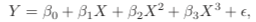  
   where β0, β1, β2, and β3 are constants of your choice.
    > ```r
    > y <- 5 + 4*x - 3*x^2 + 2*x^3 + e
    > png("ch6_ex8_b.png")
    > plot(x,y)
    > dev.off()
    > ```
    > 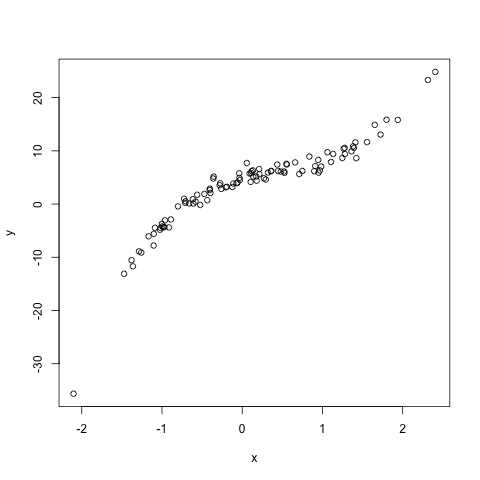  

 - c) Use the ``regsubsets()`` function to perform best subset selection in order to choose the best model containing the predictors X,X2,...,X10. What is the best model obtained according to Cp, BIC, and adjusted R2? Show some plots to provide evidence for your answer, and report the coefficients of the best model obtained. Note you will need to use the ``data.frame()`` function to create a single data set containing both X and Y .
    > ```r
    >library(leaps)
    >data = data.frame(y = y, x = x)
    >mod = regsubsets(y ~ poly(x, 10, raw = T), data = data, nvmax = 10)
    >mod.summary = summary(mod)
    > ```
    >Mejor cp:
    >```r
    >which.min(mod.summary$cp)
    >png("ch6_ex8_c1.png")
    >plot(mod.summary$cp, xlab = "Subset Size", ylab = "Cp", pch = 20, type = "l")
    >points(3, mod.summary$cp[3], pch = 4, col = 2, lwd = 2)
    >dev.off()
    >```
    >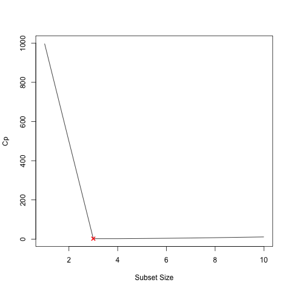  
    >Mejor BIC:
    >```r
    >which.min(mod.summary$bic)
    >png("ch6_ex8_c2.png")
    >plot(mod.summary$bic, xlab = "Subset Size", ylab = "BIC", pch = 20, type = "l")
    >points(3, mod.summary$bic[3], pch = 4, col = 2, lwd = 2)
    >dev.off()
    >```
    >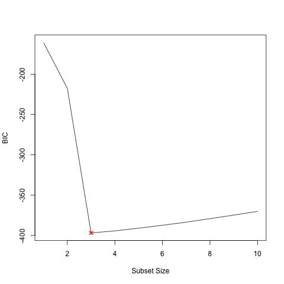  
    >Mejor R^2:
    >```r
    >which.max(mod.summary$adjr2)
    >png("ch6_ex8_c3.png")
    >plot(mod.summary$adjr2, xlab = "Subset Size", ylab = "Adjusted R^2", pch = 20, type = "l")
    >points(5, mod.summary$adjr2[5], pch = 4, col = 2, lwd = 2)
    >dev.off()
    >```
    >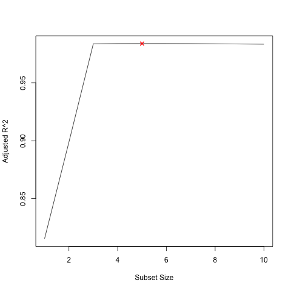  
    >El mejor modelo, viendo el cp y el BIC es el de grado 3, sin embargo, viendo el r^2 el mejor modelo es el de grado 5, pero comparadndolo con el de grado 3 la diferencia no es mucha, menos del 5%

 - d) Repeat (c), using forward stepwise selection and also using backwards stepwise selection. How does your answer compare to the results in (c)?
    >```r
    >mod.fwd = regsubsets(y ~ poly(x, 10, raw = T), data = data, nvmax = 10,method = "forward")
    >mod.bwd = regsubsets(y ~ poly(x, 10, raw = T), data = data, nvmax = 10,method = "backward")
    >fwd.summary = summary(mod.fwd)
    >bwd.summary = summary(mod.bwd)
    >```
    >El mejor cp:
    >```r
    >which.min(fwd.summary$cp)
    >which.min(bwd.summary$cp)
    >```
    >El mejor bic:
    >```r
    >which.min(fwd.summary$bic)
    >which.min(bwd.summary$bic)
    >```
    >El mejor R^2:
    >```r
    >which.max(fwd.summary$adjr2)
    >which.max(bwd.summary$adjr2)
    >```
    >Comparando backward selection (derecha) y forward selection (izquierda).  
    >```r
    >png("ch6_ex8_d.png")
    >par(mfrow = c(3, 2))
    >plot(fwd.summary$cp, xlab = "Subset Size", ylab = "Forward Cp", pch = 20, type = "l")
    >points(3, fwd.summary$cp[3], pch = 4, col = 2, lwd = 2)
    >plot(bwd.summary$cp, xlab = "Subset Size", ylab = "Backward Cp", pch = 20, type = "l")
    >points(3, bwd.summary$cp[3], pch = 4, col = 2, lwd = 2)
    >plot(fwd.summary$bic, xlab = "Subset Size", ylab = "Forward BIC", pch = 20,
   >     type = "l")
    >points(3, fwd.summary$bic[3], pch = 4, col = 2, lwd = 2)
    >plot(bwd.summary$bic, xlab = "Subset Size", ylab = "Backward BIC", pch = 20,
   >     type = "l")
    >points(3, bwd.summary$bic[3], pch = 4, col = 2, lwd = 2)
    >plot(fwd.summary$adjr2, xlab = "Subset Size", ylab = "Forward Adjusted R^2",
   >     pch = 20, type = "l")
    >points(3, fwd.summary$adjr2[3], pch = 4, col = 2, lwd = 2)
    >plot(bwd.summary$adjr2, xlab = "Subset Size", ylab = "Backward Adjusted R^2",
   >     pch = 20, type = "l")
    >points(4, bwd.summary$adjr2[4], pch = 4, col = 2, lwd = 2)
    >dev.off()
    >```
    >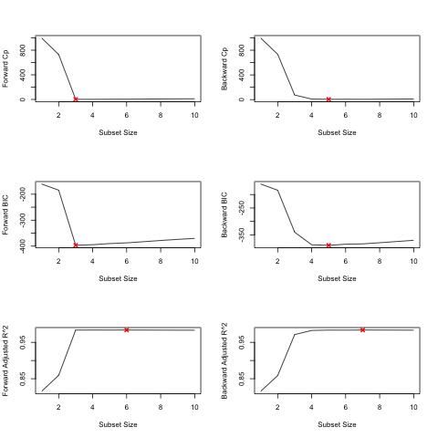  
    > Con selección hacia adelante parece ser que el mejor modelo es el de grado 3, mientras que el mejor en selección hacia atras es el de grado 5, esto viendo solo cp y BIC, en el caso de R^2 lo mejor son los modelos de grado 6 y 7 respectivamente.  

 - e) Now fit a lasso model to the simulated data, again using X,X2, . . . , X 10 as predictors. Use cross-validation to select the optimal value of λ. Create plots of the cross-validation error as a function of λ. Report the resulting coefficient estimates, and discuss the results obtained.
    >```r
    >library(glmnet)
    >xmat = model.matrix(y ~ poly(x, 10, raw = T), data = data)[, -1]
    >mod.lasso = cv.glmnet(xmat, y, alpha = 1)
    >best.lambda = mod.lasso$lambda.min
    >png("ch6_ex8_e.png")
    >plot(mod.lasso)
    >dev.off()
    >```
    >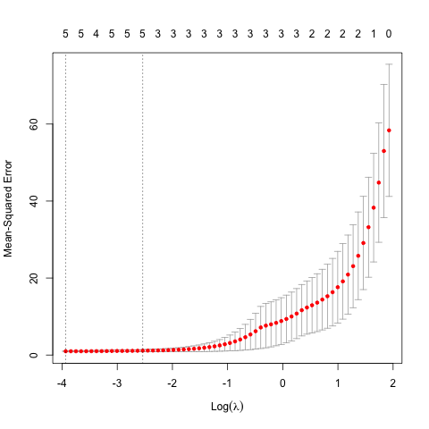  
    >```r
    >best.model = glmnet(xmat, y, alpha = 1)
    >predict(best.model, s = best.lambda, type = "coefficients")
    >```  
    >```
    >11 x 1 sparse Matrix of class "dgCMatrix"  
    >                                1  
    >(Intercept)             4.775681e+00
    >poly(x, 10, raw = T)1   4.029583e+00
    >poly(x, 10, raw = T)2  -2.770848e+00
    >poly(x, 10, raw = T)3   2.017968e+00
    >poly(x, 10, raw = T)4   .           
    >poly(x, 10, raw = T)5   .           
    >poly(x, 10, raw = T)6   .           
    >poly(x, 10, raw = T)7   .           
    >poly(x, 10, raw = T)8  -1.216931e-03
    >poly(x, 10, raw = T)9   .           
    >poly(x, 10, raw = T)10 -1.978252e-05
    >```
    >Lasso escoge un modelo con 5 variables, aunque dos de ellas tienen un valor de casi 0, los coeficientes son acertados aproximadamente.

 - f) Now generate a response vector Y according to the model  
   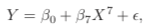  
and perform best subset selection and the lasso. Discuss the results obtained.
    >```r
    >y2 = 1 + 2 * x^7 + e
    >data = data.frame(y = y2, x = x)
    >mod = regsubsets(y2 ~ poly(x, 10, raw = T), data = data, nvmax = 10)
    >mod.summary = summary(mod)
    >```
    >Mejor cp:
    >```r
    >which.min(mod.summary$cp)
    >```
    >Mejor BIC:
    >```r
    >which.min(mod.summary$bic)
    >```
    >Mejor R^2:
    >```r
    >which.max(mod.summary$adjr2)
    >```
    >Los mejores modelos según del cp y el R^2 son de grado 3, en cuestión de BIC el mejor modelo es de grado 1.  
    >Usando lasso:
    >```r
    >xmat = model.matrix(y2 ~ poly(x, 10, raw = T), data = data)[, -1]
    >mod.lasso = cv.glmnet(xmat, y2, alpha = 1)
    >best.lambda = mod.lasso$lambda.min
    >```
    >```
    > 3.63208058954092
    >```
    >```r
    >best.model = glmnet(xmat, y2, alpha = 1)
    >predict(best.model, s = best.lambda, type = "coefficients")
    >```
    >```
    >11 x 1 sparse Matrix of class "dgCMatrix"
    >                                1
    >(Intercept)            1.48410467
    >poly(x, 10, raw = T)1  .         
    >poly(x, 10, raw = T)2  .         
    >poly(x, 10, raw = T)3  .         
    >poly(x, 10, raw = T)4  .         
    >poly(x, 10, raw = T)5  0.01001058
    >poly(x, 10, raw = T)6  .         
    >poly(x, 10, raw = T)7  1.94047390
    >poly(x, 10, raw = T)8  .         
    >poly(x, 10, raw = T)9  .         
    >poly(x, 10, raw = T)10 .         
    >
    >```
    >Lasso escoge un modelo con 2 variables, una de grado 5 y otra de grado 7, el intercepto no es tan cercano al adecuado pero el coeficiente de grado 7 es acertado; el coeficiente de grado 5 es casi 0 por lo que podríamos eliminarlo.

9. In this exercise, we will predict the number of applications received using the other variables in the ``College`` data set.
 - a) Split the data set into a training set and a test set.
    >```r
    >library(ISLR)
    >index <- sample(1:nrow(College), nrow(College)/2)
    >D.train <- College[index,]
    >D.test <- College[-index,]
    >```

 - b) Fit a linear model using least squares on the training set, and report the test error obtained.
    >```r
    >lm.fit = lm(Apps~., data=D.train)
    >lm.pred = predict(lm.fit,D.test)
    >lm.RSS = mean((D.test$Apps - lm.pred)^2)
    >lm.RSS
    >```
    >El RSS es de:
    >```
    >1410244.6662527
    >```

 - c) Fit a ridge regression model on the training set, with λ chosen by crossvalidation. Report the test error obtained.
    >```r
    >mat.train = model.matrix(Apps~., data=D.train)
    >mat.test = model.matrix(Apps~., data=D.test)
    >lambda = 10 ^ seq(4, -2, length=100)
    >mod.ridge = cv.glmnet(mat.train, D.train$Apps, alpha=0, lambda=lambda)
    >lambda.best = mod.ridge$lambda.min
    >lambda.best
    >```
    >La mejor lambda es:
    >```
    >9.3260334688322
    >```
    >```r
    >pred.ridge = predict(mod.ridge, newx=mat.test, s=lambda.best)
    >ridge.RSS = mean((D.test$Apps - pred.ridge)^2)
    >ridge.RSS
    >```
    >El RSS de test para ridge es de:
    >```
    >1465222.40612567
    >```
    >Notese que este tiene un valor mayor al obtenido por el método de mínimos cuadrados

 - d) Fit a lasso model on the training set, with λ chosen by cross- validation. Report the test error obtained, along with the number of non-zero coefficient estimates.
   >```r
   >mod.lasso = cv.glmnet(mat.train, D.train[, "Apps"], alpha=1, lambda=lambda)
   >lambda.best = mod.lasso$lambda.min
   >lambda.best
   >```
   >En este caso la mejor lambda es de:
   >```
   >12.3284673944207
   >```
   >```r
   >pred.lasso = predict(mod.lasso, newx=mat.test, s=lambda.best)
   >lasso.RSS = mean((D.test$Apps - pred.lasso)^2)
   >lasso.RSS
   >```
   >En este caso el RSS de predicción es de:
   >```
   >1490030.64226956
   >```
   >Esta vez se obtuvo un RSS incluso mayor al modelo obtenido con Ridge.

 - e) Fit a PCR model on the training set, with M chosen by crossvalidation. Report the test error obtained, along with the value of M selected by cross-validation.
   >```r
   >library(pls)
   >pcr.fit = pcr(Apps~., data=D.train, scale=TRUE, validation="CV")
   >png("ch6_ex9_f.png")
   >validationplot(pcr.fit, val.type="MSEP")
   >dev.off()
   >```
   >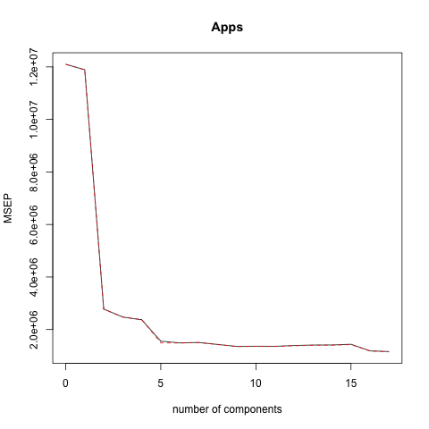
   >```r
   >pred.pcr = predict(pcr.fit, D.test, ncomp=10)
   >pcr.RSS = mean((D.test$Apps - pred.pcr)^2)
   >pcr.RSS
   >```
   >El RSS usando recresión de componentes principales es de:
   >```
   >3056660.67306315
   >```

 - f) Fit a PLS model on the training set, with M chosen by crossvalidation. Report the test error obtained, along with the value of M selected by cross-validation.
   >```r
   >pls.fit = plsr(Apps~., data=D.train, scale=TRUE, validation="CV")
   >png("ch6_ex9_f.png")
   >validationplot(pls.fit, val.type="MSEP")
   >dev.off()
   >```
   >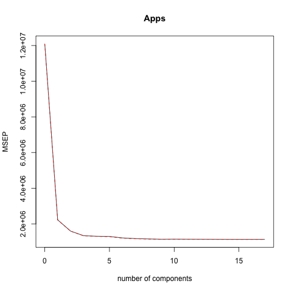
   > ```r
   >pred.pls = predict(pls.fit, D.test, ncomp=10)
   >pls.RSS = mean((D.test$Apps - pred.pls)^2)
   >pls.RSS
   >```
   >El RSS obtenido por PLS es:
   >```
   >1418007.48365563
   >```
 - g) Comment on the results obtained. How accurately can we predict the number of college applications received? Is there much difference among the test errors resulting from these five ap- proaches?
   >```r
   >png("ch6_ex9_g.png")
   >plot(1:5,c(lm.RSS,ridge.RSS,lasso.RSS,pcr.RSS,pls.RSS),ylab="RSS",xlab="Method")
   >axis(1,at = 1:5,labels=c("lm","Ridge","Lasso","PCR","PLS"))
   >dev.off()
   >```
   >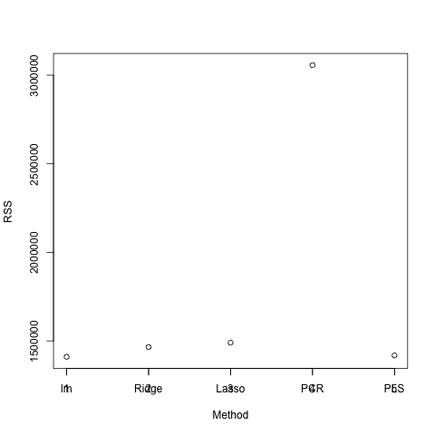
   >Parece ser que el menor RSS se alacanza con mínimos cuadrados, sin embargo no hay mucha diferencia entre modelos, exceptuando PCR, que tiene un RSS muy alto comparandolo con el resto de los modelos.

10. We have seen that as the number of features used in a model increases, the training error will necessarily decrease, but the test error may not.  
   We will now explore this in a simulated data set.
- a) Generate a data set with p = 20 features, n = 1,000 observa- tions, and an associated quantitative response vector generated according to the model Y = Xβ+ε, where β has some elements that are exactly equal to zero.
- b) Splityourdatasetintoatrainingsetcontaining100observations and a test set containing 900 observations.
- c) Perform best subset selection on the training set, and plot the training set MSE associated with the best model of each size.
- d) Plot the test set MSE associated with the best model of each size.
- e) For which model size does the test set MSE take on its minimum value? Comment on your results. If it takes on its minimum value for a model containing only an intercept or a model containing all of the features, then play around with the way that you are generating the data in (a) until you come up with a scenario in which the test set MSE is minimized for an intermediate model size.
- f) How does the model at which the test set MSE is minimized compare to the true model used to generate the data? Comment on the coefficient values.
- g) Create a plot displaying 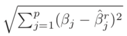
(g) Create a plot displaying j=1(βj − βj ) for a range of values of r, where βˆjr is the jth coefficient estimate for the best model containing r coefficients. Comment on what you observe. How does this compare to the test MSE plot from (d)?
11. We will now try to predict per capita crime rate in the Boston data set.
- a) Try out some of the regression methods explored in this chapter, such as best subset selection, the lasso, ridge regression, and PCR. Present and discuss results for the approaches that you consider.
- b) Propose a model (or set of models) that seem to perform well on this data set, and justify your answer. Make sure that you are evaluating model performance using validation set error, cross- validation, or some other reasonable alternative, as opposed to using training error.
- c) Does your chosen model involve all of the features in the data set? Why or why not?
